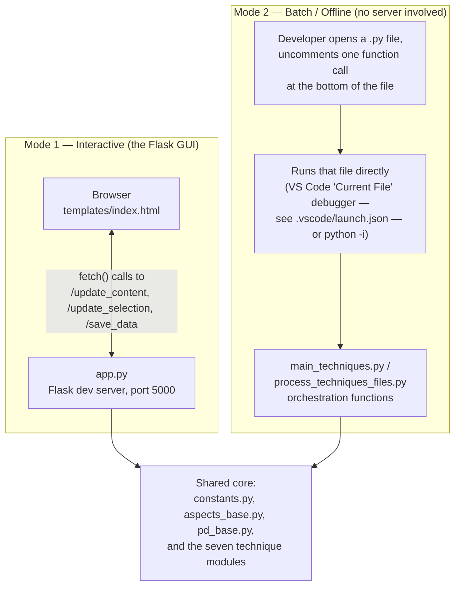
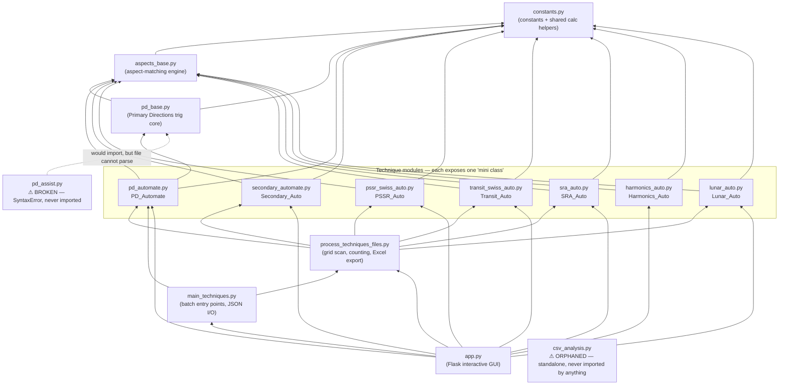
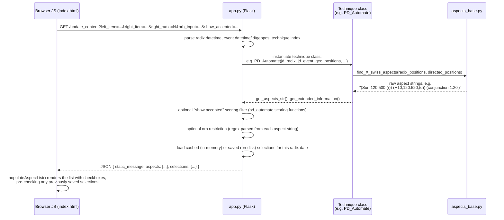
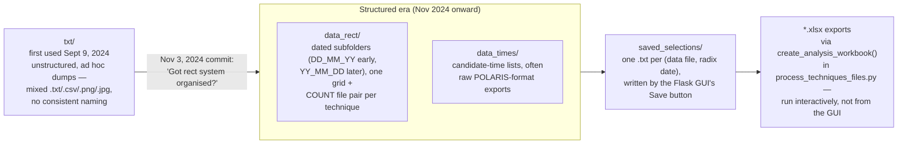
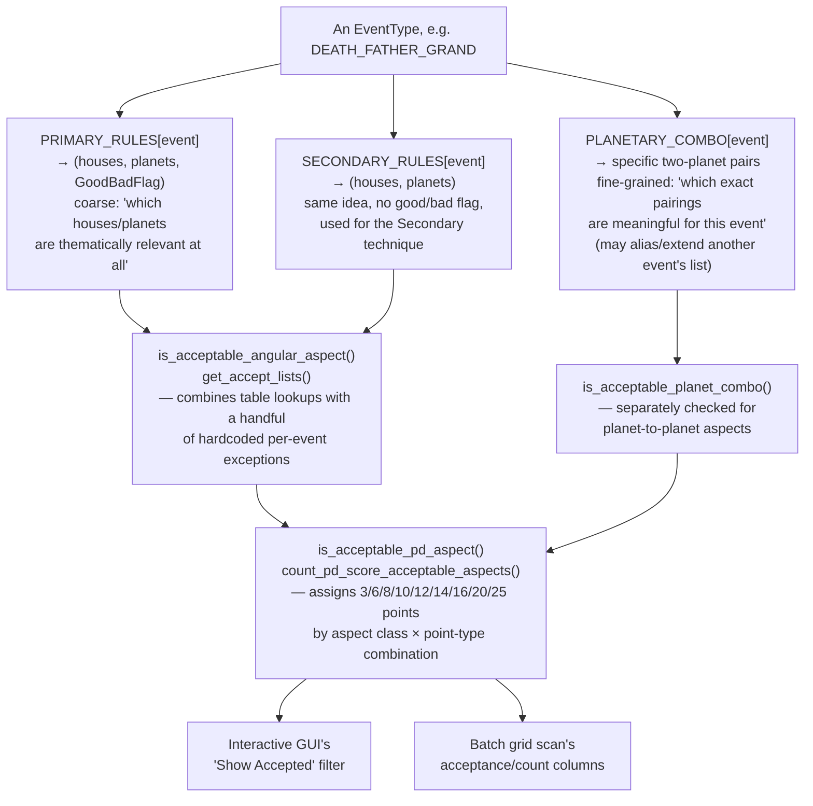
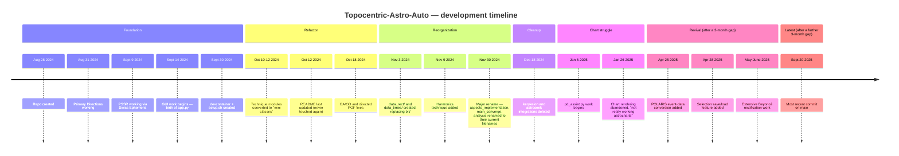

# Topocentric-Astro-Auto — Developer Manual

**Repository:** `ingFlow/Topocentric-Astro-Auto`
**Primary branch:** `main`
**Language/stack:** Python 3 (Flask) + a single vendored JS charting library
**Status:** Personal research tool, actively used Aug 2024 – Sept 2025, no formal releases, no tests, no CI

This manual was produced by a full, code-first reverse-engineering pass over the repository: every Python source file, both HTML templates, the vendored JS asset, all configuration files, the complete git history (92 commits, all branches), and representative samples from every data directory. Where the underlying intent could not be verified from the code itself, that is stated explicitly rather than guessed.

---

## Table of Contents

1. [Overview](#1-overview)
2. [System Architecture](#2-system-architecture)
3. [Getting Started](#3-getting-started)
4. [Domain Concepts Primer](#4-domain-concepts-primer)
5. [Data Model Reference](#5-data-model-reference)
6. [Module Reference](#6-module-reference)
7. [Web Application Reference](#7-web-application-reference)
8. [The Significator & Scoring System](#8-the-significator--scoring-system)
9. [Operating the System: Runbooks](#9-operating-the-system-runbooks)
10. [Data Directory Reference](#10-data-directory-reference)
11. [Known Issues & Bugs](#11-known-issues--bugs)
12. [Dead Code & Abandoned Features](#12-dead-code--abandoned-features)
13. [Duplicate / Inconsistent Implementations](#13-duplicate--inconsistent-implementations)
14. [Project History & Evolution](#14-project-history--evolution)
15. [External Dependencies & Integrations](#15-external-dependencies--integrations)
16. [Glossary](#16-glossary)
17. [Appendix A: File Inventory](#appendix-a-file-inventory)
18. [Appendix B: Open Questions for the Maintainer](#appendix-b-open-questions-for-the-maintainer)

---

## 1. Overview

**Topocentric-Astro-Auto** is a personal research tool for **astrological birth-time rectification** — the practice of determining an unknown or uncertain birth time by testing candidate times against a person's documented life events, looking for the candidate whose resulting chart(s) show the strongest correlation with those events across multiple predictive techniques.

Concretely, the system:

1. Takes a birth date (known or approximate) and a location, computed **topocentrically** (i.e. correcting planetary positions for the observer's true elevation above sea level, not just latitude/longitude — hence the project name).
2. Takes a list of dated, categorized life events for that person (births, deaths, marriages, career changes, accidents, travel, etc.).
3. Computes seven independent predictive/symbolic techniques against candidate birth times: **Primary Directions, Secondary Progressions, Precessed Solar Returns (PSSR), Transits, Cyclic Lunars, Solar Return Aspects (SRA), and Harmonics.**
4. Scores or filters the resulting planetary aspects against a large, hand-authored table of which planets/houses "belong" to which event category (a *significator table*), so the user can see which candidate times produce the most event-appropriate hits.
5. Lets the user manually review, select, and save the aspects they find convincing, and export the results to Excel for a final side-by-side comparison across candidate times.

The system was built and used almost entirely by one person, iterating over roughly 13 months (Aug 2024 – Sept 2025, with two multi-month gaps), primarily against their own life history (the file `data_input/ing tea.json`, by far the most-iterated test subject) plus about two dozen historical/celebrity figures used as practice cases (Beyoncé, Winston Churchill, JFK, Jacqueline Onassis, Elvis Presley, J.S. Bach, Che Guevara, and others) whose documented birth times or major life events provide a way to validate the method.

It is **not** a general-purpose astrology application. It has no user accounts, no database, no deployment configuration, and was never intended to run anywhere but a single developer's own machine (`app.run(debug=True, port=5000)`).

---

## 2. System Architecture

### 2.1 The two operating modes

This is the single most important architectural fact about the codebase: **there are two independent ways of driving the same calculation core**, and the repository's file layout only makes sense once you know both exist.



**Mode 1 (Interactive)** is what most developers would assume the whole project is: run `app.py`, open `http://localhost:5000`, pick a candidate time on the left, an event on the right, a technique via radio button, and see the resulting aspects for that single combination. This is good for close inspection of one candidate at a time and for building up a curated, saved list of "accepted" aspects.

**Mode 2 (Batch)** is how the hundreds of files in `data_rect/`, `data_times/`, and `txt/` were actually produced. There is **no CLI, no `argparse`, no `if __name__ == '__main__':` block anywhere except in `app.py`**. Instead, functions like `main_techniques.rect_ver_data_create(...)` are called by hand-editing the bottom of a file — every module that supports this pattern has a trailing block of commented-out example calls, functioning as an informal changelog of every batch run that was ever performed. To reproduce or extend any of the `data_rect/*` output, you uncomment (or write a new) call at the bottom of `main_techniques.py`, save, and run the file. See [Section 9](#9-operating-the-system-runbooks) for concrete examples.

Both modes ultimately call into the same seven technique classes, which is why the "core" layer (`constants.py`, `aspects_base.py`, `pd_base.py`, and the technique modules themselves) has no knowledge of Flask or of the batch orchestration layer — it's a plain calculation library that happens to have two different front doors.

### 2.2 Module dependency graph



Notes on reading this graph:

- **`harmonics_auto.py` is the only technique module not imported by `process_techniques_files.py`**, meaning Harmonics cannot currently participate in a batch grid scan — it is only reachable from the interactive Flask GUI. This is very likely simply because Harmonics was the last technique added (first appears in commits around Nov 9, 2024) and the batch orchestration functions were never extended to include it, rather than a deliberate exclusion.
- `pd_assist.py` is drawn with a dashed line because, although its source *intends* to import `pd_base` and `pd_automate`, the file itself contains a syntax error and cannot be imported by anything. See [Section 11](#11-known-issues--bugs).
- There is no package structure (`src/`, `__init__.py`, etc.) — every module lives at the repository root and imports its siblings directly by filename.

### 2.3 Request sequence (interactive mode)

The following sequence covers the most common interactive action: selecting a candidate time, an event, and a technique, and seeing the resulting aspects.



### 2.4 Data lifecycle

The repository's various data directories were not all created at once — they reflect a real reorganization event in the project's history, visible in git blame:



`txt/` was never migrated or cleaned up after the Nov 3, 2024 reorganization — it simply stopped being written to. It remains in the repository as a historical record of the earliest working version of the pipeline (including the very log file, `txt/log_md_sa_3SEP24.txt`, that documents the original ad hoc handling of the MD>SA bug described in [Section 11](#11-known-issues--bugs)).

---

## 3. Getting Started

### 3.1 Prerequisites

There is **no `requirements.txt`, `pyproject.toml`, or `Pipfile` anywhere in the repository.** The only record of Python dependencies is a single `pip install` line inside `setup.sh`. No versions are pinned.

```bash
pip install julian pyswisseph flask timezonefinder pandas requests python-datautil openpyxl
```

> Note: `python-datautil` in that line is almost certainly a typo for **`python-dateutil`** — the code imports `from dateutil.relativedelta import relativedelta` (in `pd_base.py`), and there is no package actually named `python-datautil` on PyPI. If you run `setup.sh` verbatim and something fails on `dateutil`, install `python-dateutil` explicitly.

Additional packages that are imported somewhere in the codebase but **not** listed in `setup.sh` at all:

- `seaborn`, `matplotlib`, `numpy` — used only by `csv_analysis.py`, which is an orphaned/unimported script (see [Section 12](#12-dead-code--abandoned-features)). You only need these if you intend to run that file directly.
- `pytz` — used by `process_techniques_files.py`'s timezone helpers.

### 3.2 Swiss Ephemeris data files

`pyswisseph` needs ephemeris data files on disk; the code expects them at a fixed system path, **not** a path relative to the repository:

```python
swe.set_ephe_path('/usr/share/swisseph/ephe')
```

This exact call appears at module level (i.e. runs on import) in **eight separate files**: `pd_base.py`, `pd_automate.py`, `secondary_automate.py`, `pssr_swiss_auto.py`, `transit_swiss_auto.py`, `sra_auto.py`, `harmonics_auto.py`, and `lunar_auto.py`. There is no central place where this is configured once — every technique module sets it independently and redundantly (see [Section 13](#13-duplicate--inconsistent-implementations)).

`setup.sh` populates that path by shallow-cloning the upstream Swiss Ephemeris repository purely to copy its `ephe/` data directory out:

```bash
git clone --depth 1 https://github.com/aloistr/swisseph.git /tmp/swisseph
sudo mkdir -p /usr/share/swisseph/ephe
sudo cp -r /tmp/swisseph/ephe/* /usr/share/swisseph/ephe/
rm -rf /tmp/swisseph
```

If you're setting this up somewhere `sudo`/`/usr/share` isn't appropriate (a container, a different OS, a virtualenv-only setup), you'll need to either replicate this ephemeris file placement or change all eight `set_ephe_path` call sites — there is currently no environment variable or config file indirection.

### 3.3 Running `setup.sh`

The script has accumulated some commentary that is really usage notes rather than executable code:

```bash
# RUN THESE IN TERMINAL DOES NOT WORK IN VSCODE
# chmod +x setup.sh
# sudo ./setup.sh
#python -m venv venv  IF YOU NEED A VIRTUAL ENVIRONMENT
#Set-ExecutionPolicy -ExecutionPolicy Bypass -Scope Process
#BYPASS ERROR FOR .\venv\Scripts\activate
```

The PowerShell-flavored comments (`Set-ExecutionPolicy`, `.\venv\Scripts\activate`) confirm this project was developed across **both a Linux environment (GitHub Codespaces — there is a `devcontainer setup` commit) and a local Windows machine**, which explains a handful of Windows-style backslash file paths that appear in commented-out code elsewhere in the repo (e.g. `r'data_times\25_01_07_ing_tea rect 5-15.txt'` in `main_techniques.py`).

In short: run `setup.sh` with `sudo` from a real terminal (not the VS Code integrated terminal, per the developer's own note), on Linux/macOS/WSL.

### 3.4 Running the interactive app

```bash
python app.py
```

This starts Flask on `http://localhost:5000` with `debug=True`. On startup it:

1. Verifies `data_input/` exists (exits with an error if not).
2. Ensures `static/charts/` exists (creating it if necessary — this directory is otherwise unused; see [Section 12](#12-dead-code--abandoned-features)).
3. Serves `templates/index.html`, defaulting to `data_input/ing tea.json` as the loaded person unless a different `?filename=` query parameter is supplied or a different file is picked from the dropdown.

If port 5000 is already in use (this happens often enough that the developer left themselves a note about it):

```bash
lsof -i :5000
kill -9 <pid>
```

### 3.5 Running a batch job

There is no single command for this — see [Section 9](#9-operating-the-system-runbooks) for a full walkthrough with a concrete example.

---

## 4. Domain Concepts Primer

This project assumes real working knowledge of traditional astrological technique. If you are picking this codebase up without that background, read this section before the module reference — otherwise function names like `calc_md_to_oa_data` or the difference between "direct" and "converse" will be opaque.

**Rectification** is the practice this whole tool serves: when a person's exact birth time is unknown or uncertain, an astrologer tests a range of candidate times against known life events, looking for the time whose resulting predictive-technique hits best explain those events. This project automates that testing across seven techniques simultaneously.

**Radix** (or **natal chart**) — the birth chart itself: planetary positions and house cusps at the moment and location of birth. Referred to throughout the code as `rad_*` (e.g. `rad_planets_labelled`, `rad_houses_info`).

**The seven techniques**, as implemented (values are the actual `aTechniqueType` enum in `constants.py`):

| # | Technique | Module | What it computes |
|---|-----------|--------|-------------------|
| 0 | **Primary Directions (PD)** | `pd_automate.py` + `pd_base.py` | The oldest and most mathematically involved technique: the radix chart is rotated through Right Ascension using the **Naibod key** (≈0.9857°/day, i.e. roughly "one degree per year" adjusted for the mean Sun's motion) to derive a symbolic "directed" position for each planet/angle at the time of an event, using spherical-trigonometry conversions between Right Ascension, Oblique Ascension, Meridian Distance, and Ascensional Difference. |
| 1 | **Secondary Progressions** | `secondary_automate.py` | The "day for a year" technique: the planetary positions on the Nth day after birth represent the astrological influences of the Nth year of life. |
| 2 | **PSSR — Precessed Solar Return** | `pssr_swiss_auto.py` | A solar return chart (the moment each year the transiting Sun returns to its exact natal degree), calculated with a precession correction rather than the simple tropical return. |
| 3 | **Transits** | `transit_swiss_auto.py` | Straightforward current planetary positions compared against the radix — the simplest and best-known technique. |
| 4 | **Cyclic Lunars** | `lunar_auto.py` | Lunar-return-family techniques: **LUNAR** (the Moon returning to a natal point), **KINETIC** (a more involved progressed-Moon variant, credited in the code to "the Marr/Fagan method" — see the [Glossary](#16-glossary)), and **AS_LUNAR** (Moon returning to a directed/precessed Ascendant). Each has a **DEMI** (half-cycle, 180° opposite point) variant computed when the primary return isn't temporally close to the event being tested. |
| 5 | **SRA — Solar Return Aspects** | `sra_auto.py` | Aspects from the radix to the Solar Return chart, computed in both tropical and precessed variants, and in both direct (forward) and converse (backward/"prenatal") form. |
| 6 | **Harmonics** | `harmonics_auto.py` | Each natal planetary degree is multiplied by the number of years elapsed since birth (`years_elapsed × degree`, normalized to 0–360°) and compared back to the radix. The simplest and most recently added technique — no direct/converse split, unlike every other technique. |
| 7 | **Natal** | *(not a real technique — a display mode)* | Simply lists the radix positions themselves, for reference. Present in the UI as an eighth radio button alongside the seven real techniques. |

**Direct vs. converse**: for most of these techniques, "direct" means the symbolic motion runs forward from birth toward the event (the normal case), while "converse" runs the same calculation *backward* in time (sometimes called "prenatal") — the idea being that some astrologers find converse aspects meaningful too, and a well-supported rectification candidate should ideally show up in both.

**Aspects**: the angular relationships between two points (planets, house cusps, or the Part of Fortune) that this whole system is ultimately looking for. The nine aspects recognized (`constants.ALL_ASPECTS`) are conjunction (0°), sextile (60°), square (90°), trine (120°), opposition (180°), and four "minor" aspects — semisextile (30°), semisquare (45°), sesquisquare (135°), and quincunx (150°). Every technique checks for these within a technique-specific **orb** (allowed margin of error), which varies not just by technique but often by which specific planet or point is involved — see [`aspects_base.py`](#62-aspects_basepy) for the exact orb tables.

**Part of Fortune (POF)** — a classical Arabic Lot, calculated here with the simple day formula `POF = Ascendant + Moon − Sun` (the code does not distinguish day/night charts, which is the traditional refinement; see [Section 11](#11-known-issues--bugs)).

**Angles / Houses** — `H1`/`H4`/`H7`/`H10` are the four angular houses (Ascendant, IC, Descendant, Midheaven respectively), and the code frequently relabels them for display: `H10→MC`, `H1→AS`, `H7→DS`, `H4→IC`.

**Naibod key / Naibod rate** — the specific "1 degree ≈ 1 year" conversion rate used for Primary Directions in this codebase, named for the historical astrologer Valentin Naibod. Computed as `59/60 + 8.33/3600` degrees per year (`pd_base.calc_arc`).

**OA / OD (Oblique Ascension / Oblique Descension)**, **MD (Meridian Distance)**, **AD (Ascensional Difference)**, **SA (Semi-Arc)** — the core spherical-astronomy quantities Primary Directions is built from. If you need to debug `pd_base.py`, you need to understand these; a good general reference is any traditional/classical text on Primary Directions (see the note on "Juan" in the [Glossary](#16-glossary) — the code's own comments cite an external PDF reference for this exact math).

**MDO** — "Meridian Distance Overlay" or similar (exact expansion not stated anywhere in the code or comments); computed as `(MD/SA)×90` and stored per-planet as extended info. Used only for display in the "Show Data" view, not for any scoring logic.

**Event categories** — the ~50 life-event types (`pd_automate.EventType`) that every rectification run is tested against: births/deaths of specific family members, marriage, divorce, career events, travel, accidents, illness, arrest, violence, and several house-pair "positive/negative" catch-all categories (e.g. `POSITIVE_3_9`, `NEGATIVE_6_12`). The comment above the enum states these values "correspond to the POLARIS event list" — see the [Glossary](#16-glossary) entry on POLARIS.

---

## 5. Data Model Reference

### 5.1 Birth data JSON (`data_input/*.json`)

This is the canonical input format, loaded by `main_techniques.get_json_birth_data()`. There are 28 files in `data_input/`, each representing one person: about two dozen historical/celebrity figures used as practice cases, plus the developer's own life history (`ing tea.json`, by far the most-edited and most-referenced file in the whole project) and a handful of other personal contacts.

```json
{
    "dt_radix_start": "1917-05-29T02:00:00",
    "dt_radix_end": "1917-05-29T04:00:00",
    "dt_actual_dob": "1917-05-29T03:00:00",
    "geopos_natal": [42.3555, -71.0565, 6.0],
    "list_of_events": [
        {
            "datetime": "1953-09-12T15:00:00",
            "event_type": "MARRIAGE_ENGAGEMENT_FOR_MALE",
            "geopos": [41.5307, -71.3372, 12.0]
        },
        {
            "datetime": "1963-11-22T12:30:00",
            "event_type": "DEATH",
            "geopos": [32.7791, -96.8089, 137.0]
        }
    ]
}
```

Field notes:

- **`dt_radix_start` / `dt_radix_end`** — the bounding window of uncertainty for the true birth time (used by `app.py`'s `generate_hourly_datetimes` to build the default brute-force candidate list; see [Section 9](#9-operating-the-system-runbooks)).
- **`dt_actual_dob`** — the "best known / working hypothesis" birth time. This is what `app.py`'s home route always includes as the first candidate in the left-hand list, regardless of which other candidate-generation strategy is active.
- **`geopos_natal`** — `[latitude, longitude, altitude_meters]`. The altitude is what makes this "topocentric" rather than geocentric; see `constants.get_altitude()` in [Section 6](#6-module-reference), which will look up or fetch this value if it isn't already known.
- **`list_of_events[].event_type`** — a string that must exactly match an attribute name on `pd_automate.EventType` (see [5.2](#52-eventtype-taxonomy)). `get_json_birth_data()` resolves this via `getattr(EventType, event_type_string)`; a typo here fails silently in some code paths and loudly (`AttributeError`) in others, depending on which function reads the file.
- **`list_of_events[].geopos`** — event-specific location, independent of the birth location (e.g. where a marriage or death took place). Several techniques (SRA, PSSR) use this to compute local house cusps for the event itself, not just the radix.

Formatting is **not consistent within or across files** — some events are pretty-printed across multiple lines, others are written as single-line compact JSON. This is a visible fingerprint of the files having been hand-edited across many separate sessions over many months (some via tooling that pretty-prints, some via direct manual edits) rather than always being written by a single code path.

### 5.2 `EventType` taxonomy

The complete, authoritative list, from `pd_automate.py` (values start at 1, not 0):

```python
class EventType:
    BIRTH_BROTHER = 1
    BIRTH_SISTER = 2
    BIRTH_SON = 3
    BIRTH_DAUGHTER = 4
    BIRTH_GRANDSON = 5
    BIRTH_GRANDDAUGHTER = 6
    MARRIAGE_ENGAGEMENT_FOR_MALE = 7
    MARRIAGE_ENGAGEMENT_FOR_FEMALE = 8
    CHILDS_MARRIAGE = 9
    DIVORCE_SEPARATION = 10
    DEATH_FATHER_GRAND = 11
    DEATH_MOTHER_GRAND = 12
    DEATH_SON = 13
    DEATH_DAUGHTER = 14
    DEATH_WIFE_FRIEND = 15
    DEATH_HUSBAND_FRIEND = 16
    DEATH_BROTHER = 17
    DEATH_SISTER = 18
    DEATH = 19
    ASSASINATION_SUICIDE = 20        # [sic] — spelled this way throughout the codebase
    SUCCESS_ELECTED = 21
    PROMOTION_JOB = 22
    FAILURE_DEFEATED = 23
    RESIGN_RETIRE = 24
    TRAVEL_OVERSEAS_POSITIVE = 25
    TRAVEL_POSITIVE = 26
    TRAVEL_NEGATIVE = 27
    MOBILIZATION = 28
    DEMOBILIZATION_RELEASE = 29
    ARREST = 30
    ACCIDENT = 31
    HOSPITALIZATION_ILLNESS = 32
    VIOLENCE = 33
    INTRIGUE = 34
    LOSSES = 35
    GAMBLING_LOSS = 36
    GAMBLING_GAIN = 37
    GRADUATION_PUBLICATION = 38
    MOVE_HOME = 39
    ARMY_PROMOTION = 40
    POSITIVE_AC_MC = 41
    NEGATIVE_AC_MC = 42
    POSITIVE_2_8 = 43
    NEGATIVE_2_8 = 44
    POSITIVE_3_9 = 45
    NEGATIVE_3_9 = 46
    POSITIVE_5_11 = 47
    NEGATIVE_5_11 = 48
    POSITIVE_6_12 = 49
    NEGATIVE_6_12 = 50
    BLANK = 51
```

`EventType.get_name(value)` reverses this lookup (used to render the human-readable event type in the UI). The `POSITIVE_x_y` / `NEGATIVE_x_y` entries (house-pairs 2-8, 3-9, 5-11, 6-12, plus AC-MC) are catch-all categories for events that don't fit a more specific life-event box but are still worth testing against a given house axis.

A comment directly above this class states these values **"correspond to the POLARIS event list."** `temptemp` (see [Section 12](#12-dead-code--abandoned-features)) contains an earlier, slightly different draft of this same taxonomy (different names for several categories — e.g. `DEATH_HUSBAND`/`DEATH_WIFE` instead of the current `DEATH_HUSBAND_FRIEND`/`DEATH_WIFE_FRIEND`), confirming the taxonomy itself evolved before settling into its current form.

### 5.3 `AspectType` taxonomy

Also in `pd_automate.py`, this is a **scoring-granularity** classification, not a description of the astrological aspect itself (that's `ALL_ASPECTS` in `constants.py`). It controls which acceptance/scoring rules apply when filtering aspects for the "Show Accepted" view and for batch scoring:

```python
class AspectType:
    ANGLE_PRIMARY = 0
    ANGLE_HOUSE_PRIMARY = 1
    ANGLE_HOUSE_SECONDARY = 2
    PLANETS_PRIMARY = 3
    PLANETS_SECONDARY = 4
    ANGLE_HOUSE_ANY_PLANET = 5
    MOON_PRIMARY = 6
    MOON_ANGLE_HOUSE_PRIMARY = 7
    MOON_ANGLE_HOUSE_SECONDARY = 8
    MOON_SECONDARY = 9
    ANGLE_SECONDARY = 10
    APPROPRIATE_DIRECTED_CUSP_ONLY = 11
    APPROPRIATE_DIRECTED_CUSP_PLANET_TO_CUSP = 12
    APPROPRIATE_INCLUDING_PLANET_COMBOS = 13
    FAST_TO_SLOW_COMBO = 14
```

Each batch orchestration call in `main_techniques.py` picks a specific `AspectType` per technique (see [Section 6.13](#613-main_techniquespy)); the interactive GUI's "Show Accepted" filter uses a fixed choice per technique baked into `app.py` (see [Section 7](#7-web-application-reference)).

### 5.4 The aspect string format

Every technique module's aspect-finding functions return aspects as **formatted strings**, not structured objects. This single string format is produced by `aspects_base.get_str_aspect()` and is the lingua franca of the entire system — it's what gets displayed in the GUI, written to `data_rect/*.txt`, parsed back out by `process_techniques_files.py`'s counting functions, and written into `saved_selections/*.txt`.

```
(Sun,120.50,(r)) (H10,120.52,(d)) (conjunction,1.20')
```

Reading this: the radix (`r`) Sun at 120.50° is in conjunction with the directed (`d`) Midheaven (H10) at 120.52°, with an orb of 1.20 arcminutes. Two-point aspects are always followed by a third parenthesized group giving the aspect name and the orb (in arcminutes, with a trailing `'`). The orb value is extracted elsewhere in the codebase by regex (`get_aspect_str_orb` in `app.py`, and an inline duplicate of the same pattern later in the same file — see [Section 13](#13-duplicate--inconsistent-implementations)).

### 5.5 Saved selection files (`saved_selections/*.txt`)

Written and read by `app.py`'s `/save_data` route and `parse_selection_file` (defined in both `constants.py` and, redundantly, `app.py` — see [Section 13](#13-duplicate--inconsistent-implementations)). Filename pattern: `sanitize_filename()` turns the loaded JSON's basename plus the radix candidate's ISO datetime into something like:

```
beyonce_1981-09-04_16-08-58.txt
```

File content is a simple three-level indented, colon/dash-delimited format — **not JSON**:

```
Event: 1963-11-22T12:30:00, DEATH, 1, [32.7791, -96.8089, 137.0]
  Technique: Primary Direct
    - (Sun,120.50,(r)) (H10,120.52,(d)) (conjunction,1.20')
    - (Moon,88.40,(r)) (Mars,88.55,(d)) (sextile,0.90')
  Technique: Secondary Direct
    - (Venus,201.10,(r)) (Sun,201.30,(p)) (conjunction,1.20')
Event: 1963-11-22T12:30:00, DEATH, 1, [32.7791, -96.8089, 137.0]
  Technique: PSSR
    - (Mars,15.20,(r)) (Saturn,15.80,(pssr)) (conjunction,2.40')
```

Indentation is meaningful (2 spaces = technique level, 4 spaces + `- ` = an individual accepted aspect). This entire scheme — plain indentation-delimited text instead of JSON — appears purpose-built rather than accidental (the parser, `parse_selection_file`, is one of the more carefully-written and defensively-coded functions in the codebase), but it does mean the file format has no schema validation and is easy to corrupt with a stray manual edit.

### 5.6 Rectification grid files (`data_rect/**/*.txt`)

Produced by the batch pathway (`process_techniques_files.generate_grid_angular_aspects` / `generate_grid_times_manual`). Each technique run for a given (person, candidate-time-list) combination produces **two files**: a raw grid and a "COUNT" summary.

**Raw grid** (e.g. `..._primaries.txt`) — first line is a header row, then one row per candidate time:

```
['Time', '0: 1963-11-22T12:30:00 DEATH', '1: 1953-09-12T15:00:00 MARRIAGE_ENGAGEMENT_FOR_MALE', 'Count']
['1917-05-29 02:15:00', "(Sun,...) (H10,...) (conjunction,1.20')", '', 3]
['1917-05-29 02:20:00', '', "(Venus,...) (Mars,...) (sextile,2.10')", 1]
```

Each row is written via `str(list)` and re-read via `eval()` elsewhere in the pipeline (`process_techniques_files.count_extended_aspect_groups_txt`) — a fragile, non-standard serialization choice (plain JSON or `csv` would have avoided the `eval()` dependency) that nonetheless has worked consistently within this single-user, fully-trusted-input context.

**COUNT file** (e.g. `..._primariesCOUNT.txt`) — one dict-per-row summary, keyed by category-abbreviation:

```
Row 1: {'p_a_conj': 2, 'a_p_maj': 1, 'p_h_min': 0, 'mon_p_conj': 1, 'all_conj': 3, 'all_maj': 4, 'all_m': 7}
Row 2: {'p_a_conj': 0, 'a_p_maj': 2, 'p_h_min': 1, 'mon_p_conj': 0, 'all_conj': 0, 'all_maj': 2, 'all_m': 3}
```

Category-abbreviation keys follow the pattern `{first-point-type}_{second-point-type}_{aspect-class}`: `p`=planet, `a`=angle, `h`=house, `mon`=Moon-specific; `conj`=conjunction-only, `maj`=major aspects, `min`=minor aspects, `allm`/`all_m`=grand total. See `process_techniques_files.categorize_aspect()` for the exact classification logic. **Because this categorization function itself was revised over the project's lifetime, COUNT files generated early in the project may not have exactly the same set of keys as ones generated later** — treat the key set as a per-run detail, not a fixed schema, if you're writing anything that parses these files in bulk.

Folder-naming convention: `data_rect/<prefix>_<PersonOrRunLabel>/<prefix>_<candidate-datetime>_<technique-suffix>.txt`, where `<prefix>` is a date string in `DD_MM_YY` format for folders created before ~January 2025 and `YY_MM_DD` format afterward (a real, in-place convention change partway through the project — both formats coexist in the repository).

### 5.7 `altitudes.json`

A flat cache mapping `"lat,lon"` string keys to elevation in meters:

```json
{
    "42.3555,-71.0565": 6.0,
    "40.748817,-73.985428": 15.0,
    "-26.183333,28.066667": 1784.0
}
```

Populated lazily by `constants.get_altitude()`: on a cache miss, it calls the free [Open-Elevation API](https://api.open-elevation.com) and writes the result back into this file. This is the **only outbound network call anywhere in the application logic** (as opposed to setup-time calls in `setup.sh`).

### 5.8 POLARIS export format (`data_times/*.txt`)

Several files in `data_times/` are not generated by this codebase at all — they are raw exports from an external tool or reference the code calls **POLARIS** (see the [Glossary](#16-glossary)), later ingested by `process_techniques_files.process_polaris_times()` / `main_techniques.convert_polaris_event_data_json()`. The format pairs a date+score line with a following line giving the year, e.g.:

```
     14 Nov    01:46:24  467   7     16    27    11    30
     1935
```

The numeric columns following the time (`467   7     16    27    11    30` in the example above) are POLARIS's own internal scoring/ranking values, not something computed by this codebase — `sort_polaris_times()` was written to filter candidate times by one of these columns (an "A value" per its docstring) but, as documented in [Section 11](#11-known-issues--bugs), is currently broken and cannot run.

---

## 6. Module Reference

Fifteen Python modules live at the repository root — there is no package structure, `src/` layout, or `__init__.py` anywhere. Every technique class listed below is a small, self-contained "mini class": construct it with the radix and event data, then call its getters. Note that **the constructors are not uniform** — some take a Julian Day (`jd_radix`), others take a raw Python `datetime` (`dt_radix`); some take `geopos` as a single `[lat, lon, alt]` argument, one (`Secondary_Auto`) takes `geo_lat`/`geo_long` as two separate arguments; only `Lunar_Auto` takes `orb` in its constructor at all. This table is worth keeping open while reading `app.py`, since it has to bridge all seven conventions:

| Class | Module | Constructor |
|---|---|---|
| `PD_Automate` | `pd_automate.py` | `(self, jd_rad, jd, geo_positions, rad_planets_labelled=None, rad_planets_equatorial=None, rad_houses_info=None, e=None)` |
| `Secondary_Auto` | `secondary_automate.py` | `(self, jd_radix, jd_event, geo_lat, geo_long, e, ramc=None, rad_planets=None)` |
| `PSSR_Auto` | `pssr_swiss_auto.py` | `(self, dt_radix, dt_event, rad_planets=None, geopos=None)` |
| `Transit_Auto` | `transit_swiss_auto.py` | `(self, jd_radix, jd_event, geopos, rad_planets=None)` |
| `SRA_Auto` | `sra_auto.py` | `(self, dt_radix, dt_event, geopos, rad_planets=None)` |
| `Harmonics_Auto` | `harmonics_auto.py` | `(self, jd_radix, jd_event, geopos, rad_planets=None)` |
| `Lunar_Auto` | `lunar_auto.py` | `(self, dt_radix, dt_event, geopos, geopos_natal, orb)` |

### 6.1 `constants.py`

**Role:** foundation layer. Despite the name, this file is not purely constants — it also holds several shared calculation helpers, making it a de facto "utils" module. It has no internal dependencies (only external libraries: `swisseph`, `json`, `os`, `math`, `requests`), and is imported by nearly every other file.

**Key contents:**

- `ZODIAC_SIGNS` (12), `PLANETS` (11: the ten classical bodies plus `Mean_Node` — no Chiron, no asteroids, no True Node variant), `HOUSES` (`H1`–`H12`), `PLANET_ABBREVIATIONS`.
- `ALL_ASPECTS` — dict of the nine recognized aspects (conjunction, sextile, square, trine, opposition, semisextile, semisquare, sesquisquare, quincunx), each mapped to a `(angle, 360-angle)` tuple used to test both rotational directions.
- `aTechniqueType` — the **canonical, current, 8-member** technique enum (`PRIMARY_DIRECT=0` … `NATAL=7`). A comment notes its member order was chosen to match the radio-button order in `index.html`. This is the version that should be used in any new code — see [Section 13](#13-duplicate--inconsistent-implementations) for the two other, inconsistent copies of this same concept elsewhere in the codebase.
- `get_technique_name(value)` — reverse lookup on `aTechniqueType`. (Also redefined, redundantly, inside `app.py`.)
- `calc_planets_labelled`, `calc_planets_houses_labelled`, `calc_planets_pof_houses_labelled` — the shared "compute all planet positions (+ houses, + Part of Fortune) for a given Julian Day and location" helpers that every technique module calls to get its starting radix positions. `calc_planets_pof_houses_labelled` computes POF with the simple day-formula only (`AC + Moon − Sun`); it does not check whether the chart is a day or night chart, which traditionally requires swapping to `AC + Sun − Moon` at night.
- `get_precession(date1, date2)` — ayanamsa difference between two dates, used by the PSSR and SRA "precessed" variants.
- `get_altitude(lat, lon)` — reads/writes `altitudes.json`, falling back to the Open-Elevation API on a cache miss (see [5.7](#57-altitudesjson)).
- `parse_selection_file(filepath)` — parses the `saved_selections/*.txt` format described in [5.5](#55-saved-selection-files-saved_selectionstxt). This is one of the more defensively-written functions in the repository (real logging, real exception handling). **It is shadowed by an almost-identical local redefinition inside `app.py`** — see [Section 13](#13-duplicate--inconsistent-implementations).

### 6.2 `aspects_base.py`

**Role:** the aspect-matching engine shared by every technique module. This is the file to read first if you need to change how orbs work for any technique — every technique-specific orb value lives here, hardcoded, not in a config file.

**Key contents:**

- `MAJOR_ASPECTS` — a **second, partially duplicated** copy of five of the nine entries in `constants.ALL_ASPECTS` (conjunction, sextile, square, trine, opposition — omitting the four minor aspects). `calculate_aspect()`'s `flag_major` parameter switches between this and the full `ALL_ASPECTS` set — note that despite the name, `flag_major=True` means "restrict to majors" (uses `MAJOR_ASPECTS`), not "include everything."
- `calculate_aspect(pos1, pos2, orb, flag_major)` — the single core aspect-matching primitive: checks whether the angular separation between two positions falls within `orb` of any recognized aspect angle, in either rotational direction.
- **Technique-specific aspect finders, each with hardcoded, technique-specific orbs** — this is where the astrological methodology actually lives:
  - `find_pd_swiss_aspects` — Primary Directions; very tight orbs (≤10.8′ for conjunction/opposition, ≤5.6′ otherwise), reflecting the traditional precision convention for this technique.
  - `find_pssr_swiss_aspects` — 32′ for Moon, 12′ for all other planets. A live inline comment reads: `#{CHANGE it was 14/60 before but the book says its 12'? don't know what happened}` — direct evidence the orb value has been revised at least once, from a source the developer refers to only as "the book," and that they were no longer certain why by the time this comment was written.
  - `find_secondary_swiss_aspects` — orb varies by planet group: `sun_to_pof`-class points get 11′, `jup_sat`-class get 8′, `ura_to_plu`-class (which, despite the name, also includes Neptune and the Mean Node) get 3′, Moon gets 32′.
  - `find_sra_swiss_aspects` — 68′ orb; only conjunction/opposition are checked; SR-to-SR aspects are restricted to house-to-planet only (no planet-to-planet), and one code branch explicitly excludes the Sun (`if p2 != 'Sun'`) since the Sun's return position is definitionally fixed and not informative to compare against itself.
  - `find_trans_swiss_aspects` — flat 65′ orb, all nine aspect types.
  - `find_trans_aspects` — **a second, differently-behaved transit aspect finder** taking a caller-supplied `orb` instead of a hardcoded one, restricted to major aspects only. See [Section 13](#13-duplicate--inconsistent-implementations) — it is not clear from the code alone why both exist.
- `find_aspects` / `calc_all_aspects` / `m_aspects_between_two_sets_positions` — three further, more generic aspect-finding functions used in different corners of the pipeline (the PSSR/Transit batch path, and independently by `csv_analysis.py`). `m_aspects_between_two_sets_positions`'s own docstring calls it **"legacy from using textfiles to get positions"** and it currently only implements two of the eight techniques (`ProcessType.PSSR` and `ProcessType.TRANSIT`).
- `remove_duplicates(aspect_list)` — dedupes both true duplicates and "reverse" duplicates (a p1–p2 aspect is the same finding as p2–p1), and separately discards any aspect that is purely house-to-house.
- `get_str_aspect(...)` — produces the canonical aspect string format described in [5.4](#54-the-aspect-string-format).

### 6.3 `pd_base.py`

**Role:** the low-level spherical-astronomy core for Primary Directions — Right Ascension / Oblique Ascension / Meridian Distance / Ascensional Difference / Semi-Arc trigonometry. This is genuinely dense classical-technique mathematics, not generic astrology-library code.

The file's own top-of-file docstring is worth quoting because it documents an important, non-obvious design decision:

> "there is no difference between calculating the north and south md to oa data other than when calculating with southern geo latitudes I make the geolat its absolute value and these results are giving the values corresponding to POLARIS"

In other words: hemisphere handling was deliberately collapsed into a single code path by having the *caller* pre-normalize latitude to its absolute value, rather than branching inside every trig function — and the results were calibrated against POLARIS output as the ground truth.

**Key contents:**

- `PD_Base` — the class form of the "directed position" calculation (the "mini class" refactor from Oct 2024). Constructing it with a planet's radix Right Ascension, the radix RAMC, event RAMC, and geographic latitude computes and stores the full chain of intermediate values (MD, AD, SA, Pole, ADP, OA/OD, final directed longitude) as attributes.
  - **Contains a documented, only-partially-resolved bug workaround**: if `MD > SA` (an invalid intermediate state), the code shifts to the next quadrant and retries, up to two times, logging every attempt (tagged `before`/`mid`/`last`) to `log_md_sa.txt`. See [Section 11](#11-known-issues--bugs) for the full history of this bug, including the original, cruder version of this same handling that is still preserved as a runtime artifact in `txt/log_md_sa_3SEP24.txt`.
- `get_directed_from_data(...)` — a **standalone function duplicating `PD_Base`'s logic almost line-for-line**, confirmed dead (zero callers anywhere in the codebase) — see [Section 12](#12-dead-code--abandoned-features).
- `calculate_longitude(...)` — its docstring cites **"Juan's formula in pred astro p69 pdf"** as the source of the math (see the [Glossary](#16-glossary)).
- `calculate_OA_OD(RA, ADP, quadrant, GEO_LAT)` — takes `GEO_LAT` as a parameter but **no longer uses it** in the active code path; a large commented-out block directly below the active `return` statement preserves the earlier, hemisphere-branching version of this same function, left in place rather than deleted.
- `calc_arc(...)` — implements the **Naibod key** (`59/60 + 8.33/3600` degrees/year ≈ 0.9857°/day).
- `get_date_of_conjunction(...)` — the inverse operation: given an arc, computes the calendar date on which a "static" point (Ascendant/MC) would reach conjunction with a moving point.
- A large commented-out block at the very bottom of the file is an ad hoc manual test using the birth data of J.S. Bach (29/31 March 1685, Eisenach — matching `data_input/bach.json`).
- Ends with the module-level `swe.set_ephe_path('/usr/share/swisseph/ephe')` call — see [Section 3.2](#32-swiss-ephemeris-data-files) and [Section 13](#13-duplicate--inconsistent-implementations) for why this appears in eight different files rather than once.

### 6.4 `pd_automate.py`

**Role:** the largest file in the repository (865 lines) and the single biggest concentration of hand-authored astrological domain knowledge. If you need to understand *why* the system considers a given aspect meaningful for a given event, this is the file.

**Key contents:**

- `Planet` — three-letter planet-code constants (`SUN`, `MON`, `MER`, …) used as dictionary keys throughout the significator tables.
- `EventType`, `AspectType` — see [5.2](#52-eventtype-taxonomy) and [5.3](#53-aspecttype-taxonomy).
- `GoodBadFlag` — `GOOD=0`, `BAD=1`, `NEUTRAL=2`.
- `PD_Automate` — the technique class; see the constructor table at the top of this section. Combines directed/converse house cusps, directed/converse planetary longitudes, and directed Part of Fortune into one object, exposing `get_aspects_str()` (returns a `(direct, converse)` string tuple), `get_extended_information()` (a nested dict used by the GUI's "Show Data" view), and `get_mdos_natal()`.
- **`PRIMARY_RULES` / `SECONDARY_RULES`** — dicts mapping every `EventType` to a tuple of `(relevant_houses, relevant_planets, GoodBadFlag)` (primary) or `(relevant_houses, relevant_planets)` (secondary). This is the hand-curated significator table: e.g. `BIRTH_SON` maps to houses `H4`/`H1`/`H5` and planets Mars/Sun/Jupiter/the Node, flagged `GOOD`.
- **`PLANETARY_COMBO`** — an even more granular table mapping each `EventType` to specific two-planet pairings considered significant for that event. Several entries reference *other* `EventType` entries instead of repeating a full combo list, e.g. `TRAVEL_OVERSEAS_POSITIVE` is defined as "everything in `TRAVEL_POSITIVE`'s list, plus the Uranus–Pluto pair," and `ARREST` is a pure alias for the whole of `FAILURE_DEFEATED`'s list. `is_acceptable_planet_combo()` has to branch on four different possible shapes of a dict value (plain list of pairs; single-int alias; int-plus-extra-pairs; bare int) to support this compression scheme.
- `is_acceptable_angular_aspect()` / `get_accept_lists()` — the acceptance-filtering logic driving the GUI's "Show Accepted" checkbox. Beyond the table-driven rules above, this function layers **hardcoded, event-specific exceptions directly in the control flow** for at least `HOSPITALIZATION_ILLNESS` and `ASSASINATION_SUICIDE` — the acceptance logic is not purely data-driven.
- `is_acceptable_pd_aspect()` / `count_pd_score_acceptable_aspects()` — a **weighted numeric scoring rubric** (25/20/16/14/12/10/8/6/3 points depending on aspect class and which kind of point is involved: Angle-to-Primary-Planet scores highest, Secondary-House-to-Secondary-Planet lowest, etc.). Despite the "pd" in the name, this function is also reused by the GUI for Secondary, Transit, SRA, and Harmonics scoring (see [Section 7](#7-web-application-reference)) — only PSSR uses a separate function, `count_event_acceptable_aspects()`.
- Dead utilities (never called anywhere): `add_suffix_to_tuples`, `calc_alt`, `calc_lst`.
- A live `TODO` at the site of the angle/house acceptance rules: `#{TODO the logic here of the angle_rules and house_aspect_rules is not correct, need to fix}` — an acknowledged, still-open defect.

### 6.5 `secondary_automate.py`

**Role:** Secondary Progressions ("day for a year"). `Secondary_Auto.__init__` takes `geo_lat`/`geo_long` as two separate floats (the only technique class that does not take a combined `geopos`), plus a required `e` (obliquity) parameter.

`get_all_secondary_positions()` computes the progressed Julian Day as `jd_radix + (days_since_birth / 365.2422)`, then derives progressed planetary positions and progressed house cusps (via `swe.houses_armc`) at that adjusted date, compared back to the radix.

### 6.6 `pssr_swiss_auto.py`

**Role:** Precessed Solar Return. `calc_pssr_direct_year()` determines the correct return year for a given event date; the return moment itself is located precisely using `swe.solcross_ut` (exact ecliptic-longitude crossing of the Sun). The Sun itself is excluded from the resulting aspect set (`exclude_planets`), since by definition the Sun always exactly returns to its natal degree and comparing it to itself is not informative.

### 6.7 `transit_swiss_auto.py`

**Role:** the simplest technique — straightforward current-sky-to-radix comparison, direct and converse (mirrored) dates, flat 65′ orb via `aspects_base.find_trans_swiss_aspects`.

### 6.8 `sra_auto.py`

**Role:** Solar Return Aspects, computed in both tropical and precessed forms, both direct and converse. `SRA_Auto.__init__` takes `dt_radix`/`dt_event` (Python `datetime`, not Julian Day).

Contains a small but real inefficiency: `dir_precession` is computed **twice in immediate succession** with different arguments, and the first result is discarded, unused, before the second overwrites it — the same pattern repeats for `conv_precession`. This has no functional effect beyond wasted computation, and reads as a leftover from a change of approach that was never cleaned up. A commented-out block at the bottom of the file contains three sets of unlabeled test coordinates (roughly matching Manchester and London, England) used during development.

### 6.9 `harmonics_auto.py`

**Role:** the smallest (44 lines) and most recently introduced technique (first appears in commit history around Nov 9, 2024). `years_elapsed = (dt_event - dt_radix).days / 365.2422`; each natal degree is multiplied by this and normalized modulo 360°, then compared back to the radix using `aspects_base.find_trans_swiss_aspects` (i.e. it reuses the Transit orb table rather than defining its own). **This is the only technique whose class does not compute a direct/converse pair** — `Harmonics_Auto.get_str_aspects()` returns a single string, where every other technique class returns a `(direct, converse)` tuple. It is also the only technique not wired into the batch orchestration functions in `main_techniques.py` (see [Section 2.2](#22-module-dependency-graph)).

### 6.10 `lunar_auto.py`

**Role:** the Cyclic Lunars family. `LunarType` has three members: `LUNAR` (standard lunar return), `KINETIC` (a more involved progressed-Moon technique, credited in an inline comment to **"the Marr/Fagan method"** — see the [Glossary](#16-glossary)), and `AS_LUNAR` (Moon returning to a directed/precessed Ascendant).

`Lunar_Auto.__init__` is the only technique constructor that takes `orb` directly (as a required positional argument) and the only one that distinguishes `geopos` (event location) from `geopos_natal` (birth location) as two separate parameters.

Each `LunarType` additionally computes a **DEMI** (half-cycle, 180°-opposite) variant, calculated whenever the primary return point falls more than 14 days from the event date — the reasoning being that if the main return isn't temporally close to the event, the half-cycle point might be. `calc_kinetic_demi_dir_conv` / `calc_kinetic_dir_conv` / `calc_bija_days` implement the Kinetic method's specific correction (a "Bija" adjustment — a term from sidereal/Hindu astronomical tradition), reinforcing that this technique's specific formulation is drawn from a fairly specialized, non-mainstream lineage of technique (see the [Glossary](#16-glossary) entry on Fagan/Marr).

`count_mal_ben_from_str_aspects` / `count_mal_ben_all_lunars` / `count_each_planet_lunars` provide the malefic/benefic tally shown in the GUI alongside the Lunar aspect list — a piece of analysis unique to this technique.

`get_str_only_aspects_from_data()` is confirmed **dead and broken** — it instantiates `Lunar_Auto` with six positional arguments (including a nonexistent `ltype` parameter) against a five-parameter constructor. Never called anywhere; see [Section 11](#11-known-issues--bugs).

A commented-out block at the bottom contains unlabeled manual test data and debug prints referencing `"moon dirNQL"` / `"moon convNQL"` — "NQL" is not expanded anywhere in the codebase or comments; treat it as an unresolved internal abbreviation (possibly tied to the same Marr/Fagan lineage as Kinetic).

### 6.11 `pd_assist.py`

**Role:** unknown/incomplete — and unreachable. This file **does not parse**: it ends mid-statement (`jd_mature = jd_rad +`) with no closing expression, confirmed via `ast.parse()`. It is never imported by any other file, so this defect has no effect on the running system — but attempting to run or import this file directly (e.g. via VS Code's "Current File" debugger, the project's standard workflow) will raise `SyntaxError`.

Its single function, `get_natal_arc`, appears to have been intended to compute the arc (in years) between two planets' Oblique Ascensions, then convert that into some kind of "maturity" date — plausibly connected to the git commit `"implemented pssr rect assist tools"` (Jan 6, 2025), which is the last point at which this file was touched. Full detail in [Section 11](#11-known-issues--bugs).

### 6.12 `csv_analysis.py`

**Role:** a standalone, orphaned data-analysis script — confirmed never imported by any other module. Depends on `pandas`, `seaborn`, `matplotlib`, and `numpy`, none of which are listed in `setup.sh`.

Defines its own **third, independent copy** of the technique-type concept (`class TechniqueType`, using yet another naming convention — `Primary_Direct`, `Secondary_Direct`, etc. — different from both other copies; see [Section 13](#13-duplicate--inconsistent-implementations)), plus `extract_data_from_file`, `load_and_concatenate_files`, `count_all_col`, `count_all_major`, `count_all_major_opp`, and `create_csv_count_txt`. Has its own `main()` that is never invoked by an `if __name__ == '__main__':` guard (there is none in this file) — running `python csv_analysis.py` currently does nothing at all. Its output format matches a real file preserved in `txt/` (`20_10_ver1_sorted_planet_data.csv`), confirming it was run manually at least once, historically, likely via an interactive session.


### 6.13 `main_techniques.py`

**Role:** the entry point for the **batch** operating mode (see [Section 2.1](#21-the-two-operating-modes)) — this is what you import and call from an interactive session or a temporarily-uncommented line to run a full rectification scan without touching the Flask app at all.

**Key contents:**

- `timesFileType` — an enum (`POLARIS`, `DATE_N_TIME`, `TIMES_ONLY`, `MANUAL_RECT`, by this reading of the code) describing which of several candidate-time-list formats a given batch run should expect; `get_times_from_file()` dispatches on this to pick the right parser from `process_techniques_files.py`.
- `parse_coordinate(...)` — parses degree-minute-second-plus-hemisphere-letter coordinate strings (e.g. `"51N30"`), as opposed to the plain decimal floats used everywhere else in the JSON data — this exists specifically to support ingesting POLARIS-format exports, which use this notation.
- `convert_polaris_event_data_json(...)` — parses a raw POLARIS event-list export (see [5.8](#58-polaris-export-format-data_timestxt)) into this project's own `data_input/*.json` schema. Its hardcoded default `output_data` template is pre-filled with a real birth data example (Houston, TX coordinates), which is simply the last shape the function was tested against, left in place as the default rather than cleared to something clearly placeholder — treat it as a template shape reference, not sample data.
- `convert_manual_birth_data_json(...)` — writes a new `data_input/*.json` file from a manually-supplied birth data + events dict, opening the target file in **append mode (`"a"`)**. This only produces valid JSON if the target file did not already exist (i.e. this is a create-once helper, not a merge/update helper) — calling it twice against the same filename will produce a file containing two concatenated JSON objects, which is not valid JSON and will fail to load. As of this writing no file in `data_input/` shows evidence of having been double-written this way, but the risk is latent in the function itself.
- `get_json_birth_data(filepath)` — the canonical loader; defines the schema documented in [5.1](#51-birth-data-json-data_inputjson). Resolves each event's `event_type` string via `getattr(EventType, ...)`.
- **Three distinct batch orchestration functions**, each choosing a different subset of techniques and a different `AspectType` granularity per technique:
  - `pd_rect_grid_score_create(...)` — Secondary + Primary Direction only, using a single caller-supplied `AspectType` level for both.
  - `rect_ver_data_create(...)` — Secondary, PSSR, Transit, and Primary Direction, each with its own hardcoded `AspectType` (PSSR gets `MOON_ANGLE_HOUSE_PRIMARY`; Transit gets `ANGLE_HOUSE_PRIMARY`; Secondary and Primary both get `APPROPRIATE_DIRECTED_CUSP_PLANET_TO_CUSP`). Sets a local `flag_count_moon` variable that is never actually passed into any downstream call — a harmless but genuine dead local.
  - `other_techniques_from_times(...)` — Secondary, PSSR, and Transit (no Primary Direction), using the **older**, non-"extended" counting function (`count_aspect_groups_txt` rather than `count_extended_aspect_groups_txt`) and a different output-file suffix convention (`_secondaries` rather than `_second`), suggesting it predates or was simply never migrated alongside the other two orchestration functions.
  
  All three write output using the `data_rect/<folder>/<prefix>_...` convention described in [5.6](#56-rectification-grid-files-data_recttxt), and all three are invoked, historically, exactly the way described in [Section 2.1](#21-the-two-operating-modes) — by hand-editing a commented-out call at the bottom of this file. That trailing block of commented-out calls is effectively a run-log of real historical batch jobs (Thomas Jefferson data conversion, several `ing tea` rectification passes, a Millard convergence sum, etc.) and is a useful reference for correct call syntax even though none of it is meant to run as-is.
- `count_pssr_moon_write(...)` — thin wrapper writing `process_techniques_files.count_pssr_moon_from_times_events`'s output to CSV.

### 6.14 `process_techniques_files.py`

**Role:** the second-largest file (867 lines) and the workhorse behind everything in `data_rect/` and `data_times/`. This module bridges raw per-technique aspect output and the aggregate scoring/ranking/export layer, and supports **multiple, genuinely different strategies** for building a candidate-time list — these are not simple duplicates of each other; they reflect different rectification workflows used at different points in the project (a full brute-force day scan vs. importing an externally-scored POLARIS list vs. a manually curated CSV).

**Key contents:**

- `TechniqueType` — a **second, incomplete copy** of `constants.aTechniqueType` (five members: `PRIMARY_DIRECT`, `SECONDARY_DIRECT`, `PSSR`, `TRANSIT`, `LUNAR` — missing `SRA`, `HARMONICS`, `NATAL`), defined and used locally in this file **despite `constants.aTechniqueType` being imported into the same file already**. One function, around line 103, contains `elif date_technique == TechniqueType.SRA:` — a reference to an attribute this local class does not define. See [Section 11](#11-known-issues--bugs) for the exact failure mode.
- `generate_grid_angular_aspects(...)` / `append_grid_acceptable_angles(...)` — the core grid-scan engine: for a given technique, a list of candidate times, and a list of events, computes every aspect for every (candidate × event) cell and writes the raw grid file described in [5.6](#56-rectification-grid-files-data_recttxt).
- `categorize_aspect(...)` — classifies a single aspect string into a short category code (`p_a_conj`, `a_p_maj`, `p_h_min`, `mon_p_conj`, `p_p_min`, …) as described in [5.6](#56-rectification-grid-files-data_recttxt). A live `TODO` here (`#{TODO decide whether to integrate p_p directions...}`) documents an open, unresolved design question about whether planet-to-planet directions should be included in the accepted-count total.
- `count_extended_aspect_groups_txt(...)` — the newer, more detailed counting/tallying function (reads a raw grid file, using `eval()` to deserialize each `str(list)`-formatted row, and writes the corresponding COUNT file). `count_aspect_groups_txt(...)` is the **older, simpler predecessor**, still used by `main_techniques.other_techniques_from_times` but superseded everywhere else.
- `generate_grid_times_manual(...)` — variant of the grid engine that takes an explicit candidate-time list rather than generating one internally.
- Candidate-time-list builders/importers, each a genuinely different strategy:
  - `generate_hourly_datetimes(dt_start, dt_end)` — the brute-force scanner, producing a dense list of candidate times (5-minute granularity) across a date range. This is `app.py`'s **default** strategy for populating the left-hand candidate list.
  - `process_manual_rect_csv(...)` — reads a CSV of bare `HH:MM:SS` time-of-day strings against a fixed day, with midnight-crossing/timezone handling.
  - `process_polaris_times(...)` — parses the raw two-line POLARIS export format described in [5.8](#58-polaris-export-format-data_timestxt).
  - `sort_polaris_times(...)` — intended to filter/sort a POLARIS-format file by its own internal "A value" score column. **Confirmed broken**: the parameter name uses a full-width Unicode underscore (`file_write＿name`) while the function body references the ordinary-underscore `file_write_name`, and similarly references `valid＿lines` where `valid_lines` was defined — both are guaranteed `NameError`s if this function is ever called. See [Section 11](#11-known-issues--bugs).
  - `count_pssr_moon_from_times_events(...)` — a Moon-conjunction/opposition-specific PSSR scoring pass, output as a ranked CSV.
  - `process_datetime_count_csv(...)` / `process_time_count_csv(...)` — read back the ranked CSV output of an earlier stage as a plain candidate-time list, for a subsequent narrower pass.
  - `get_timezone_from_pos(...)` — wraps `timezonefinder` for local/UTC conversion.
- `delete_rows_below_threshold_counttxt(...)` — filters and sorts a COUNT file by its final numeric column, descending — a simple narrowing utility.
- **Cross-technique convergence**: `sum_sec_prim(...)` / `read_file(...)` / `sum_all_m(...)` / `write_result(...)` — sums the `all_m` total from a Primary Directions COUNT file and a Secondary Progressions COUNT file for matching timestamps, producing the `*_summed_prim_sec.txt` files seen throughout `data_rect/`. This is the literal implementation of the "convergence" concept the orchestrator module (`main_techniques.py`) was originally named for (`main_converge.py`, prior to a November 2024 rename — see [Section 14](#14-project-history--evolution)): looking for candidate times supported by more than one technique simultaneously.
- `create_analysis_workbook()` — an **interactive, `input()`-driven** CLI function (not reachable from the Flask GUI) that prompts for a person's JSON filename and a set of techniques, then builds an Excel workbook from the corresponding `saved_selections/*.txt` files, one sheet per (technique, run-timestamp) pair, via `openpyxl`. This is how `beyonce_rectification_analysis.xlsx` and `beyonce_rectification_analysis_grouped.xlsx` were produced. Includes a cleanup step meant to remove `openpyxl`'s default blank sheet, guarded by a check for the sheet being named exactly `"Sheet"` — the `_grouped` workbook in the repository still has a leftover `"Sheet1"` tab, suggesting this specific guard condition did not match in that run.
- `abbreviate_aspect_string(...)` / `sanitize_sheet_name(...)` — Excel-export-specific formatting helpers.

### 6.15 `app.py`

**Role:** the Flask application and the **only file in the entire repository with an `if __name__ == '__main__':` guard** — every other module is a pure library, importable but not designed to be run as a top-level script (aside from the "temporarily uncomment a call and hit F5" batch workflow described throughout this manual).

At module scope, `app.py` maintains a handful of **global, mutable variables** rather than using Flask's session or application-context mechanisms — an intentional-enough simplification given this is a single-user, single-process tool, but worth knowing before extending it: `geo_pos_natal`, `dt_radix`, `lunar_orb` (default 9), `restrict_orb` (default 3), `current_file` (default `"ing tea.json"`), and `selections_data` (an in-memory cache of parsed selection files, keyed by radix date, populated lazily and mutated directly by route handlers via the `global` keyword).

Full route-by-route documentation is in [Section 7](#7-web-application-reference). Two things worth flagging at the module level rather than the route level:

- `app.py` **imports `kerykeion`'s `AstrologicalSubject`/`KerykeionChartSVG` in a commented-out line** and never uses either — a direct remnant of the abandoned server-side chart-rendering approach (see [Section 12](#12-dead-code--abandoned-features)).
- `app.py` defines **local copies of two functions that are also importable from `constants.py`** — `parse_selection_file` and `get_technique_name` — and because both are defined after the corresponding import statement, Python's normal name resolution means the local versions silently win. See [Section 13](#13-duplicate--inconsistent-implementations).


---

## 7. Web Application Reference

### 7.1 Routes

All routes are defined in `app.py`. There is no blueprint structure, no API versioning, and no authentication of any kind.

| Route | Method | Line | Status | Purpose |
|---|---|---|---|---|
| `/` | GET | 37 | **Active** | Home page. Loads the selected `data_input/*.json` file (default: `ing tea.json`), builds the left column (candidate times) and right column (events), renders `index.html`. |
| `/update_content` | GET | 187 | **Active** | The core interactive endpoint — given a candidate time, an event, a technique index, and display flags, computes and returns the aspect list as JSON. |
| `/update_selection` | POST | 442 | **Active** | Toggles one aspect's selected/accepted state in the in-memory `selections_data` cache. Does not write to disk. |
| `/save_data` | POST | 492 | **Active** | Persists the current in-memory selections for a given radix date to `saved_selections/*.txt`, in the format described in [5.5](#55-saved-selection-files-saved_selectionstxt). |
| `/custom_action` | POST | 548 | **Dead** | Accepts arbitrary JSON and echoes it back in a message string. No frontend code calls this route (confirmed by search — zero references in `templates/` or `static/`). Its counterpart in the frontend, `templates/inf.html`'s `customAction()` JS function, is itself never rendered by any route. Both are remnants of an abandoned custom-right-click-menu experiment; see [Section 12](#12-dead-code--abandoned-features). |
| `/chart-data` | GET | 579 | **Dead** | Returns a **hardcoded, fixed** JSON object of sample planetary/cusp positions — not computed from any real chart. The sample data even includes points (`NNode`, `Lilith`, `Chiron`) that the rest of the system never calculates. Not called by any frontend code. |
| `/generate_chart` | GET | 635 | **Broken** | Intended to render a natal-chart SVG via `kerykeion`. Path/filename construction logic is present and active, but the actual `AstrologicalSubject` / `KerykeionChartSVG` generation call is **entirely commented out** — the route currently does not produce a chart. |

### 7.2 `/update_content` in detail

This is the endpoint that does almost all of the real work in the interactive mode, and the one most worth understanding fully if you're extending the GUI.

**Query parameters:**

| Parameter | Meaning |
|---|---|
| `left_item` | The selected candidate radix datetime (ISO string) |
| `right_item` | The selected event, serialized as `"<datetime>, <EventType name>, <event_id>, [<lat>, <lon>, <alt>]"` — note this is **not JSON**; it's parsed with a naive `.split(', ')`, which relies on the location list's own comma-separated values lining up predictably with the split. Location brackets are stripped by manual string slicing (`event_info[3][1:]`, `event_info[5][:-1]`) rather than a proper parser. |
| `right_radio` | Integer 0–7, matching `constants.aTechniqueType` |
| `orb_input` | Orb restriction in arcminutes; `-1` means "no restriction" |
| `show_accepted` | `"true"`/`"false"` — whether to apply the technique's acceptance filter |
| `show_data` | `"true"`/`"false"` — whether to return the raw computed-data dict instead of the aspect list |

**Behavior, in order:**

1. Parses `right_item` into a datetime, `EventType`, event ID, and geoposition.
2. Instantiates the appropriate technique class for `right_radio` (see the constructor table in [Section 6](#6-module-reference)) using the already-computed radix data cached from the home route.
3. Retrieves `(direct_aspects, converse_aspects)` (or, for `NATAL`, simply lists the radix positions; for `LUNAR`, additionally computes the malefic/benefic tally).
4. Cosmetically relabels angular houses for display: `H10→MC`, `H1→AS`, `H7→DS`, `H4→IC`.
5. If `show_accepted=true`, applies a filter — **the specific filter function depends on the technique**:
   - PD, Secondary, Transit, SRA, Harmonics → `pd_automate.count_pd_score_acceptable_aspects(...)`
   - PSSR → `pd_automate.count_event_acceptable_aspects(..., AspectType.FAST_TO_SLOW_COMBO)` (a different function, with an extra parameter)
   - **Lunar and Natal → no filter is applied at all.** The "Show Accepted" checkbox is present in the UI regardless of which technique is selected, but is a functional no-op for two of the eight radio options. This is a real, observable gap in feature coverage rather than a bug in the traditional sense — nothing crashes, the checkbox just does nothing for those two techniques.
6. If `orb_input != -1`, filters every aspect string by its own embedded orb value (parsed via a regex identical to, but not reusing, the module-level `get_aspect_str_orb` helper — a small inline duplication).
7. If `show_data=true`, returns `get_extended_information()` / `get_dict_info()` instead of the aspect strings — PD and Lunar get special nested-dict formatting (including a specific case for the `"MDOs"` key), other techniques get flat key/value formatting.
8. Looks up any previously saved/cached selections for this radix date (in-memory cache first, `saved_selections/*.txt` on cache miss) and returns them alongside the aspects, so the frontend can pre-check previously accepted items.
9. Returns everything as JSON.

### 7.3 Frontend: `templates/index.html`

A single-page, three-column layout, no framework (plain JS + `fetch`), styled with a navy/gold custom color scheme and Google-hosted fonts (Yrsa, Oranienbaum). No build step — the file is served by Flask exactly as written.

- **Left column**: a `<select>` for choosing which `data_input/*.json` file is active, a scrollable list of candidate times (`left-list`, populated from `left_column_items`), a "Show Accepted only" checkbox, eight technique radio buttons (values `0`–`7`, matching `aTechniqueType`), and an orb-restriction number input (default `-1`).
- **Middle column**: a short context/summary line, and the scrollable aspect list itself (checkboxes, populated by `populateAspectList()`).
- **Right column**: manual datetime/coordinate text inputs, a button — still labeled **`"Hi"`**, evidently never renamed from a development placeholder — that calls `generateChart()`, a scrollable event list (`right-list`), a "Show Data" checkbox, and a "Load Chart" button calling `loadChart()`.
- The chart library `static/js/astrochart.js` (an unmodified, byte-identical copy of `node_modules/@astrodraw/astrochart/dist/astrochart.js` — there is no build pipeline; it was manually copied in) is loaded on every page load.
- **`generateChart()` and `loadChart()` are, verbatim, empty function bodies**:
  ```javascript
  async function generateChart(rightItem = null) { /* ... keep as is ... */ }
  async function loadChart() { /* ... keep as is ... */ }
  ```
  Clicking either button currently does nothing. Combined with the dead `/chart-data` and broken `/generate_chart` routes and the commented-out `kerykeion` import, the entire chart-visualization feature — frontend button, JS handler, Flask route, and SVG generation call — is non-functional at every layer of the stack. See [Section 12](#12-dead-code--abandoned-features) for the full evidence trail, including the git history that corroborates this.
- The remaining JS (`updateMiddleContent`, `populateAspectList`, `sendSelectionUpdate`, `saveSelectionsForDate`, `updateLocalSelectionCache`, and the page's `DOMContentLoaded` handler) implement the interaction loop described in [Section 2.3](#23-request-sequence-interactive-mode): selecting a list item triggers a `fetch` to `/update_content`; checking/unchecking an aspect triggers a `fetch` to `/update_selection`; the Save button triggers a `fetch` to `/save_data`. Several functions carry comments like `/* ... keep as is ... */` and `// MERGED AND CORRECTED DOMContentLoaded` in a style consistent with AI-assisted code editing (a pattern also visible in `templates/inf.html` — see below) rather than being purely hand-written.

### 7.4 `templates/inf.html` (orphaned)

Never rendered by any route — `render_template()` is called exactly once in the entire codebase, always with `'index.html'`. This template is a **standalone prototype of a custom right-click context menu**, with a single "Custom Action" item whose handler shows a plain `alert()` and contains the comment `// Call your Flask app function here` — the intended wiring to the (equally orphaned) `/custom_action` route was never completed. The file's `<head>` also contains a stray block of prose that reads like an AI image-captioning tool's description of a code screenshot, apparently pasted in by accident rather than the actual code snippet it was meant to represent — further circumstantial evidence of AI-assisted authorship for this experiment.


---

## 8. The Significator & Scoring System

This is the intellectual core of the project — the part that turns "here are some planetary aspects" into "here is why candidate time X is more plausible than candidate time Y for this specific event." It lives almost entirely in `pd_automate.py`, even though (as noted in [Section 7.2](#72-update_content-in-detail)) its scoring functions are reused by five of the seven techniques, not just Primary Directions.

### 8.1 Three layers of rules



### 8.2 Worked example

Take `EventType.DEATH_FATHER_GRAND` (value 11). Its `PRIMARY_RULES` entry associates this event with the 10th/1st/8th houses and Saturn/Sun/Neptune/Pluto/Mars/the Node, flagged `BAD`. If a batch or interactive run finds a Primary-Directed aspect between (say) directed Saturn and the natal 8th-house cusp for a candidate birth time, at the exact time the event actually occurred, that aspect:

1. Passes `is_acceptable_angular_aspect()` because Saturn and H8 both appear in `DEATH_FATHER_GRAND`'s `PRIMARY_RULES` entry.
2. Is scored by `is_acceptable_pd_aspect()` — a House-to-Planet conjunction/opposition scores in the higher band (20 points if it's a Primary House, 16 if Secondary), lower for softer aspects.
3. Contributes to that candidate time's running total, which is what ultimately gets summed and compared across candidates via `process_techniques_files.sum_sec_prim()` and its relatives.

### 8.3 The `AspectType` granularity layer

`AspectType` (documented fully in [5.3](#53-aspecttype-taxonomy)) doesn't describe the astrological aspect itself — it describes **what kind of point-pairing** is being scored (Angle-to-Primary-Planet vs. Angle-to-Secondary-House vs. Moon-specific vs. a "fast-planet-to-slow-planet combo," etc.), and different batch orchestration calls in `main_techniques.py` deliberately choose a coarser or finer `AspectType` depending on how much signal-vs-noise tradeoff is wanted for that specific run (see the three orchestration functions documented in [6.13](#613-main_techniquespy)).

### 8.4 Where the rules came from

The rules tables read as transcriptions from an external methodology, not something invented from scratch — several code comments cite sources directly:

- `pd_base.calculate_longitude()`'s docstring: *"Juan's formula in pred astro p69 pdf."*
- `pd_base.py`'s file-level docstring states its hemisphere-normalized results are calibrated to match **POLARIS**.
- `pd_automate.EventType`'s comment: *"the values correspond to the POLARIS event list."*
- `aspects_base.find_pssr_swiss_aspects()`'s inline comment about an orb value: *"the book says its 12'."*

None of these sources are named more specifically anywhere in the repository. Treat "Juan," "the book," and "POLARIS" as external references this project depends on for its methodology but does not itself document — see [Appendix B](#appendix-b-open-questions-for-the-maintainer).

---

## 9. Operating the System: Runbooks

### 9.1 Interactive: explore one candidate time against one event

1. `python app.py`, open `http://localhost:5000`.
2. Pick a person from the file dropdown (defaults to `ing tea.json`).
3. Click a candidate time in the left list (defaults to a dense hourly/5-minute scan across `dt_radix_start`–`dt_radix_end`, plus `dt_actual_dob`).
4. Click an event in the right list.
5. Pick a technique radio button.
6. The middle column updates with that technique's aspects for that (candidate, event) pair. Toggle "Show Accepted only" to apply the significator-table filter (remember: this is a no-op for Lunar and Natal — see [7.2](#72-update_content-in-detail)); adjust the orb box to restrict by tightness.
7. Check any aspects worth keeping — this updates the in-memory selection cache immediately.
8. Click **Save** to persist the current candidate's selections to `saved_selections/`.
9. Repeat across candidates/events/techniques. Re-visiting a previously-saved candidate automatically restores its checkboxes.

### 9.2 Batch: run a full rectification grid scan for a person

There is no CLI for this — you write and run a short script (or use one of the pre-existing commented-out call templates in `main_techniques.py`/`app.py` as a starting point). A minimal example, run either as a script (`python run_rect.py`) or pasted into an interactive session:

```python
import main_techniques
from pd_automate import AspectType

main_techniques.rect_ver_data_create(
    r"data_input/example_person.json",   # birth data + events file
    r"data_times/example_narrowed.csv",  # candidate-time list (or generate one — see 9.3)
    "data_rect/26_06_25_ExamplePerson/26_06_25_"  # output folder + filename prefix
)
```

This produces one grid file + one COUNT file per technique (Secondary, PSSR, Transit, Primary Direction) inside the target folder, following the naming convention in [5.6](#56-rectification-grid-files-data_recttxt). To include Lunar or SRA, you'd need to either extend `rect_ver_data_create` or call the relevant technique's `_automate`/`_auto` module directly against your own loop over candidate times and events — neither is currently wired into any of the three existing batch orchestration functions.

### 9.3 Generating a candidate-time list

Pick the strategy that matches how much you already know:

- **No idea at all, need a brute-force scan**: `process_techniques_files.generate_hourly_datetimes(dt_start, dt_end)` — this is what `app.py`'s home route uses by default.
- **You have a POLARIS export**: `process_techniques_files.process_polaris_times(path)`, or convert it to this project's native format first with `main_techniques.convert_polaris_event_data_json(...)`. Do **not** use `sort_polaris_times()` to pre-filter — it is currently broken (see [Section 11](#11-known-issues--bugs)); filter manually or fix the function first.
- **You already have a hand-picked list of times-of-day**: `process_techniques_files.process_manual_rect_csv(path)`.
- **Narrowing an existing ranked CSV from a previous pass**: `process_techniques_files.process_datetime_count_csv(path)` or `process_time_count_csv(path)`.

### 9.4 Narrowing candidates after a scan

1. Run `delete_rows_below_threshold_counttxt()` on a COUNT file to drop low-scoring rows.
2. If you have both a Primary Directions COUNT file and a Secondary Progressions COUNT file for the same candidate list, run `sum_sec_prim()` to produce a combined `*_summed_prim_sec.txt` ranking — candidates supported by both techniques simultaneously will rank highest. This is the practical implementation of the "convergence" the project was originally structured around.

### 9.5 Exporting a final comparison to Excel

`create_analysis_workbook()` in `process_techniques_files.py` is interactive (`input()`-driven) and must be run directly, not through the Flask app:

```python
import process_techniques_files
process_techniques_files.create_analysis_workbook()
# Prompts for a data_input/*.json filename, then a set of technique indices to include.
# Reads the corresponding saved_selections/*.txt files and writes an .xlsx
# with one sheet per (technique, save-timestamp) pair.
```

You must have already saved selections via the interactive GUI ([9.1](#91-interactive-explore-one-candidate-time-against-one-event)) for this to have anything to export — it reads from `saved_selections/`, not from `data_rect/`.

### 9.6 Adding a new person

1. Create `data_input/<name>.json` following the schema in [5.1](#51-birth-data-json-data_inputjson). Every `event_type` string must exactly match an `EventType` attribute name (see [5.2](#52-eventtype-taxonomy)) — there is no validation at load time for most call paths, so a typo will surface as a runtime error at an inconvenient point rather than at load time.
2. If you're converting from a POLARIS export instead of writing the JSON by hand, use `main_techniques.convert_polaris_event_data_json(...)`.
3. If you're adding data programmatically for a brand-new file, `main_techniques.convert_manual_birth_data_json(...)` works — but only once per filename (see the append-mode caveat in [6.13](#613-main_techniquespy)). For any subsequent edit to that same file, edit the JSON directly.

---

## 10. Data Directory Reference

| Directory | Contents | Status |
|---|---|---|
| `data_input/` | 28 birth-data + life-event JSON files, one per person. See [5.1](#51-birth-data-json-data_inputjson). | **Active** — this is real input data, not generated output. |
| `data_rect/` | 41 dated subfolders, 289 files total. Raw aspect grids and COUNT summaries from batch runs. See [5.6](#56-rectification-grid-files-data_recttxt). | **Active/historical** — generated output, safe to regenerate or delete per-folder if you no longer need a given run's results. |
| `data_times/` | Candidate-time lists in various formats (CSV, POLARIS-format .txt, narrowed/sorted variants). See [5.8](#58-polaris-export-format-data_timestxt). | **Active/historical** — mix of raw external imports and generated intermediate output. |
| `txt/` | The original, unstructured pre-November-2024 dumping ground: mixed `.txt`/`.csv`/screenshots/`.jpg` files with inconsistent naming, superseded by `data_rect/`+`data_times/` on Nov 3, 2024 but never migrated or deleted. Contains `log_md_sa_3SEP24.txt`, the runtime artifact documenting the original MD>SA bug handling (see [Section 11](#11-known-issues--bugs)). | **Historical/legacy** — kept for reference; not written to by any current code path. |
| `saved_selections/` | 63 `.txt` files, one per (person, radix-candidate-date), written by the Flask app's Save button. See [5.5](#55-saved-selection-files-saved_selectionstxt). | **Active** — this is the closest thing this project has to "curated results." |
| `cache/kerykeion_geonames_cache.sqlite` | An HTTP response cache (tables `responses`, `redirects` — the standard schema used by the `requests-cache` library) generated automatically by `kerykeion`'s geocoding lookups. | **Orphaned** — `kerykeion` is not installed by `setup.sh` and is not imported anywhere in the active codebase (only in a commented-out line in `app.py`). This file is a leftover from before that dependency was dropped; safe to delete. |
| `altitudes.json` | Elevation lookup cache. See [5.7](#57-altitudesjson). | **Active**. |
| `static/charts/` | Created automatically on Flask startup if missing; nothing currently writes chart files into it, since `/generate_chart`'s SVG generation call is commented out. | **Dormant** — exists only because startup code creates it, currently unused. |
| `node_modules/` | A single npm dependency, `@astrodraw/astrochart`, fully committed to version control (not `.gitignore`'d). `static/js/astrochart.js` is a manually-copied, byte-identical duplicate of `node_modules/@astrodraw/astrochart/dist/astrochart.js`. | **Vendored dependency** — there is no frontend build step; this is how the JS library actually reaches the browser. |
| `beyonce_rectification_analysis.xlsx`, `beyonce_rectification_analysis_grouped.xlsx` | Output of `create_analysis_workbook()` (see [9.5](#95-exporting-a-final-comparison-to-excel)), run against `saved_selections/beyonce_*.txt`. | **Active/historical** output artifact. |


---

## 11. Known Issues & Bugs

### 11.1 Confirmed crashes (will raise an exception if the affected code path is exercised)

| # | Location | Issue | Verified by |
|---|---|---|---|
| 1 | `pd_assist.py`, line 38 (entire file) | File ends mid-statement (`jd_mature = jd_rad +`) and does not parse as valid Python. | `python3 -c "import ast; ast.parse(open('pd_assist.py').read())"` → `SyntaxError: invalid syntax`. Confirmed never imported by any other module, so this has no effect on the running system — but the file cannot be run or imported on its own. |
| 2 | `process_techniques_files.py`, `TechniqueType` class (~line 28) vs. its use at ~line 103 | Local `TechniqueType` class defines only `PRIMARY_DIRECT`, `SECONDARY_DIRECT`, `PSSR`, `TRANSIT`, `LUNAR` — but a conditional later in the same file compares against `TechniqueType.SRA`, which does not exist on this class. | Direct source inspection — `constants.aTechniqueType` (imported into the same file) does define `SRA`, but the local shadow class does not. Will raise `AttributeError` if control flow ever reaches that `elif` branch with an SRA-equivalent technique value. |
| 3 | `process_techniques_files.py`, `sort_polaris_times()` | Parameter declared as `file_write＿name` (full-width Unicode underscore, U+FF3F) but referenced in the function body as `file_write_name` (ordinary underscore). Same mismatch for `valid＿lines`/`valid_lines`. | Direct source inspection. Guaranteed `NameError` on any call. A matching commented-out call site exists at the bottom of the same file, referencing a filename that matches a real file in `data_times/`, suggesting this was attempted historically and abandoned once it failed. |
| 4 | `lunar_auto.py`, `get_str_only_aspects_from_data()` | Calls `Lunar_Auto(dt_radix, dt_event, geopos, geopos_natal, ltype, orb)` — six positional arguments, including `ltype` — against a constructor that accepts exactly five: `(self, dt_radix, dt_event, geopos, geopos_natal, orb)`. | Direct source inspection. Confirmed via search that this function is never called anywhere in the codebase, so the bug is currently dormant. Almost certainly a leftover from before `Lunar_Auto`'s constructor was refactored to internally loop over all `LunarType` values rather than take one at a time. |

### 11.2 Known-incorrect or partially-worked-around logic

| # | Location | Issue |
|---|---|---|
| 5 | `pd_automate.py`, ~line 305 | Live `TODO` acknowledging the angle/house acceptance rules are wrong: `#{TODO the logic here of the angle_rules and house_aspect_rules is not correct, need to fix}`. Not resolved as of the latest commit. |
| 6 | `pd_base.py`, `PD_Base.set_directed_data()` | The `MD > SA` invalid-state case (an intermediate value that should never exceed its bound) is handled by shifting to the next quadrant and retrying, up to twice, with every attempt logged to `log_md_sa.txt`. This is a **workaround with diagnostics, not a root-cause fix** — the original condition that produces `MD > SA` in the first place is not explained anywhere in the code or comments. The much cruder original version of this same handling (a plain "PAY ATTENTION!!!!!!" warning dump) survives as a runtime artifact in `txt/log_md_sa_3SEP24.txt`, showing the handling was refined over time without ever being fully explained. |
| 7 | `constants.py`, `calc_planets_pof_houses_labelled()` | Part of Fortune is always computed with the day-chart formula (`AC + Moon − Sun`). Traditional practice swaps to `AC + Sun − Moon` for a night chart (Sun below the horizon); this distinction is not implemented. |
| 8 | `process_techniques_files.py`, ~line 238 | Live `TODO` on whether planet-to-planet ("p_p") directions should be included in the accepted-aspect count total: `#{TODO decide whether to integrate p_p directions i put them here cause level_aspects is what will filter them out if need be}`. Currently included but flagged as an open design question. |
| 9 | `main_techniques.py`, `convert_manual_birth_data_json()` | Opens its target file in append mode (`"a"`). Valid only if the target file does not already exist; a second call against the same filename will produce two concatenated JSON objects, which is not valid JSON. No file currently in `data_input/` shows evidence of this having happened, but the risk is latent and unguarded. |
| 10 | `pd_base.py`, `calculate_OA_OD()` | Accepts a `GEO_LAT` parameter that is no longer referenced anywhere in the active function body — hemisphere handling was moved to the caller (which now always passes `abs(latitude)`), but the parameter itself, and a large commented-out block implementing the old hemisphere-branching version, were never removed. |
| 11 | `process_techniques_files.py`, `create_analysis_workbook()` | Its cleanup step for `openpyxl`'s default blank worksheet checks specifically for a sheet named `"Sheet"`; `beyonce_rectification_analysis_grouped.xlsx` (a real output of this function) still contains a leftover `"Sheet1"` tab, indicating this guard did not match on at least one occasion. |

### 11.3 Minor inefficiencies (no functional impact, but worth knowing about)

| # | Location | Issue |
|---|---|---|
| 12 | `sra_auto.py` | `dir_precession` (and separately `conv_precession`) is computed twice in immediate succession with different arguments; the first result is discarded before the second overwrites it. Reads as a leftover from a change of approach. |
| 13 | `main_techniques.py`, `rect_ver_data_create()` | Sets a local `flag_count_moon` variable that is never passed into any downstream call — dead but harmless. |


---

## 12. Dead Code & Abandoned Features

### 12.1 Dead functions (defined, never called, confirmed by exhaustive search)

| Function | Location | Notes |
|---|---|---|
| `get_directed_from_data()` | `pd_base.py` | Near-line-for-line duplicate of the `PD_Base` class's logic, predating the Oct 2024 "mini class" refactor. |
| `calc_alt()` | `pd_automate.py` | Standalone altitude-from-LST/RA/Dec/latitude helper. No caller anywhere. |
| `calc_lst()` | `pd_automate.py` | Local sidereal time helper. No caller anywhere. |
| `add_suffix_to_tuples()` | `pd_automate.py` | Generic tuple-labeling helper. No caller anywhere. |
| `reset_globals()` | `app.py` | Defined to reset the module's global state variables; never called by any route. |
| `get_str_only_aspects_from_data()` | `lunar_auto.py` | Also broken — see [Bug #4](#111-confirmed-crashes-will-raise-an-exception-if-the-affected-code-path-is-exercised). |

### 12.2 Entirely orphaned files

| File | Status |
|---|---|
| `pd_assist.py` | Contains a syntax error (see [Bug #1](#111-confirmed-crashes-will-raise-an-exception-if-the-affected-code-path-is-exercised)) and is never imported. Its one incomplete function, `get_natal_arc`, was apparently intended to compute an arc-derived "maturity" date between two planets' Oblique Ascensions. Last touched around the "implemented pssr rect assist tools" commit (Jan 6, 2025). |
| `csv_analysis.py` | Never imported by any other module. Depends on `pandas`/`seaborn`/`matplotlib`/`numpy`, none of which are in `setup.sh`. Has its own `main()`, never invoked by any `if __name__ == '__main__':` guard (there is none in this file). Confirmed to have been run manually at least once historically — its CSV output format matches a real file preserved in `txt/`. |
| `templates/inf.html` | Never rendered by any Flask route (confirmed: `render_template()` is called exactly once anywhere in the codebase, always with `'index.html'`). A standalone prototype of a custom right-click context menu; see [12.3](#123-the-abandoned-charting-subsystem) and [12.4](#124-the-abandoned-custom-context-menu). |

### 12.3 The abandoned charting subsystem

This is the most complete abandoned-feature story in the repository, with corroborating evidence at every layer of the stack:

- `app.py` contains a commented-out `from kerykeion import AstrologicalSubject, KerykeionChartSVG` and never uses either name elsewhere.
- The `/generate_chart` route constructs file paths and does timezone/technique-position lookups, but its actual SVG-generation call is entirely commented out — the route currently produces nothing.
- The `/chart-data` route returns hardcoded, static sample data (including points — `NNode`, `Lilith`, `Chiron` — that no other part of the system ever computes), unconnected to any real calculation.
- The frontend's `generateChart()` and `loadChart()` JavaScript functions are empty (`/* ... keep as is ... */`, no implementation).
- The button that triggers `generateChart()` is still labeled **"Hi"** — evidently never updated from a development placeholder.
- `static/js/astrochart.js` (a vendored copy of the `@astrodraw/astrochart` npm package) is still loaded on every page load, feeding nothing.
- Git history corroborates all of the above: `"Deleted kery and astroseek"` (Dec 18, 2024) removed an earlier, apparently-working server-side-rendering integration and an integration with the site astro-seek.com; `"not really working astrocharts"` (Jan 26, 2025) is the last commit touching chart rendering. The `old-push` branch (a stale checkpoint pointer, not a divergent line of work — see [14.3](#143-branches)) still contains two `static/charts/*.svg` output files and a since-deleted `templates/index_k.html` (very likely a `kerykeion`-specific variant of the index page), evidence of the earlier, since-abandoned rendering approach.

If chart rendering is wanted going forward, this needs to be built essentially from scratch on either side: either finish wiring `/chart-data` to real computed positions and implement `generateChart()`/`loadChart()` against `static/js/astrochart.js` (client-side rendering, the more recent of the two attempts), or restore the `kerykeion` import, add it back to `setup.sh`, and un-comment `/generate_chart`'s SVG generation call (server-side rendering, the earlier attempt).

### 12.4 The abandoned custom context menu

`templates/inf.html` (never rendered — see [12.2](#122-entirely-orphaned-files)) and the `/custom_action` Flask route (defined, but confirmed never called by any frontend code) are two halves of the same unfinished experiment: a custom right-click context menu, whose JS handler explicitly comments `// Call your Flask app function here` but was never actually connected to `/custom_action`.

### 12.5 Dormant directories and orphaned artifacts

| Item | Status |
|---|---|
| `static/charts/` | Created automatically on every Flask startup (startup code checks for and creates it if missing) but nothing currently writes into it, since chart generation is disabled (see [12.3](#123-the-abandoned-charting-subsystem)). |
| `cache/kerykeion_geonames_cache.sqlite` | An HTTP-response cache automatically generated by `kerykeion`'s geocoding functionality (table structure matches the `requests-cache` library). `kerykeion` is neither installed by `setup.sh` nor imported anywhere active — this file is a leftover from before that dependency was dropped. |
| `temptemp` (repository root, no extension) | A 284-line unfilled scratch template listing life-event categories (an earlier, slightly different draft of the `EventType` taxonomy — see [5.2](#52-eventtype-taxonomy)) alongside placeholder headers for "Marr," "POLARIS," and "Juan Combos" comparison data. Every category section is empty — no actual data was ever filled in. Reads as an abandoned first attempt at organizing the significator research that ultimately became `pd_automate.py`'s tables. |
| `txt/` (entire directory) | Superseded by `data_rect/`+`data_times/` on Nov 3, 2024 (see [14](#14-project-history--evolution)) but never migrated or deleted. No current code path writes to it. |
| `astroseek` integration | Fully removed — zero references anywhere in the current codebase (confirmed by search). Only evidence of its prior existence is the git commit message `"Deleted kery and astroseek"` (Dec 18, 2024). |
| Branches `React-App-Convert`, `old-push` | Despite the suggestive name, `React-App-Convert` contains **zero commits not already reachable from `main`** — it is a stale pointer into `main`'s own past, not an abandoned parallel rewrite. Likewise `old-push`. Both are safe to delete if you want to tidy up the remote branch list; neither represents unmerged work. |


---

## 13. Duplicate / Inconsistent Implementations

### 13.1 Three incompatible "technique type" enumerations

The same underlying concept — "which of the seven/eight techniques is this" — is defined independently three times, and they do not agree with each other:

| Definition | Location | Members | Casing convention |
|---|---|---|---|
| `aTechniqueType` | `constants.py` | 8: adds `SRA`, `HARMONICS`, `NATAL` on top of the other two | `ALL_CAPS` |
| `TechniqueType` | `process_techniques_files.py` | 5: `PRIMARY_DIRECT`, `SECONDARY_DIRECT`, `PSSR`, `TRANSIT`, `LUNAR` | `ALL_CAPS` |
| `TechniqueType` | `csv_analysis.py` | 4 (no `LUNAR`) | `Capitalized_With_Underscores` — a distinct style from both other copies |

`constants.aTechniqueType` is the current, canonical, most-complete version and the one used by the Flask GUI. `process_techniques_files.py` **imports `aTechniqueType` from `constants.py` and then separately defines and uses its own, older, incomplete copy anyway** — this is the direct cause of [Bug #2](#111-confirmed-crashes-will-raise-an-exception-if-the-affected-code-path-is-exercised). `csv_analysis.py`'s copy is the most divergent of the three (different casing, fewest members), consistent with it being the oldest / least-maintained of the three (that file is also entirely orphaned — see [12.2](#122-entirely-orphaned-files)). If you need to touch technique-type logic anywhere, standardize on `constants.aTechniqueType` and treat the other two as candidates for deletion.

### 13.2 Functions redefined locally in `app.py`, shadowing perfectly good imports

`app.py` imports both `parse_selection_file` and `get_technique_name` from `constants.py` — and then, later in the same file, **defines its own local functions with the same names**. Because the local definitions come after the import statement, ordinary Python name resolution means the local versions silently win; the imported versions become unreachable dead code the moment the module finishes loading.

- **`parse_selection_file`**: the two versions are *almost* identical — `app.py`'s local copy has one extra debug `print("Parsed Dictionary:", ...)` statement and minor comment differences, suggesting it started as a copy of the `constants.py` version that was then edited in place rather than the shared version being updated and re-imported.
- **`get_technique_name`**: `constants.py`'s version calls `aTechniqueType.get_all_techniques()`; `app.py`'s local version instead builds the same mapping via a hand-written dict literal.

Neither divergence is currently harmful (both pairs behave equivalently in practice), but both are exactly the kind of thing that will bite someone who edits the `constants.py` version expecting `app.py`'s behavior to change too.

### 13.3 Two Primary Directions implementations

`pd_base.get_directed_from_data()` (standalone function) and the `pd_base.PD_Base` class compute the same directed-position pipeline. The class is the current, actively-used version (constructed throughout `pd_automate.py`); the standalone function is dead (see [12.1](#121-dead-functions-defined-never-called-confirmed-by-exhaustive-search)). Safe to delete once you've confirmed you don't need it as a reference for the class's own logic.

### 13.4 Two transit aspect finders

`aspects_base.py` defines both `find_trans_swiss_aspects()` (hardcoded 65′ orb, checks all nine aspect types, used by `transit_swiss_auto.py` and `harmonics_auto.py`) and `find_trans_aspects()` (caller-supplied orb, major aspects only, additional planet/house category filtering). It is not documented anywhere why both exist or which is preferred going forward; from the naming and the fact that the "swiss" suffix pattern matches the naming convention used by the currently-active technique modules (`pssr_swiss_auto.py`, `transit_swiss_auto.py`), the `_swiss_` version reads as the more current one.

### 13.5 Partially duplicated aspect-angle tables

`constants.ALL_ASPECTS` (9 aspects) and `aspects_base.MAJOR_ASPECTS` (the same 5 major aspects, redefined rather than derived by filtering `ALL_ASPECTS`) overlap. If you ever need to add a new aspect type (e.g. a different minor aspect), both dicts need to be updated, and there is no test or assertion that would catch it if you only updated one.

### 13.6 Two generations of the aspect-counting function

`process_techniques_files.count_aspect_groups_txt()` (older, simpler) and `count_extended_aspect_groups_txt()` (newer, more detailed category breakdown) coexist. Only `main_techniques.other_techniques_from_times()` still uses the older function; the other two batch orchestration functions use the newer one. This is very likely simply an incomplete migration rather than a deliberate choice to keep both.

### 13.7 Redundant Swiss Ephemeris path configuration

`swe.set_ephe_path('/usr/share/swisseph/ephe')` is called at module level — i.e., it runs as a side effect of import — independently in **eight different files**: `pd_base.py`, `pd_automate.py`, `secondary_automate.py`, `pssr_swiss_auto.py`, `transit_swiss_auto.py`, `sra_auto.py`, `harmonics_auto.py`, and `lunar_auto.py`. There is no central application-startup configuration step; every technique module is fully self-sufficient in this respect, which is consistent with each having originally been bootstrapped by copying an earlier module and modifying it, rather than being factored out from a shared base at the time they were written.

### 13.8 Inconsistent technique-class constructor conventions

Documented in full at the top of [Section 6](#6-module-reference): some technique classes take a Julian Day (`jd_radix`), others a Python `datetime` (`dt_radix`); most take `geopos` as a single `[lat, lon, alt]` argument, `Secondary_Auto` takes `geo_lat`/`geo_long` separately, and `Lunar_Auto` additionally distinguishes `geopos` from `geopos_natal`. `app.py`'s `/update_content` route has to convert between these conventions per-technique when it instantiates each class — there is no shared adapter or base class enforcing a single calling convention.


---

## 14. Project History & Evolution

Reconstructed from the full git history (92 commits on `main`, Aug 28, 2024 – Sept 20, 2025) rather than from any changelog (none exists). Commit messages are informal and diary-like throughout — this project was never written with an audience in mind, which is itself a useful fact to know before reading too much polish into anything.

### 14.1 Timeline



### 14.2 Narrative

**Foundation (Aug 28 – Sept 30, 2024).** The repository begins with Primary Directions, the most mathematically involved technique, working first (`"pd's working"`, Aug 31). PSSR follows via direct Swiss Ephemeris calls (`"swiss pssr's working"`, Sept 9). Development briefly used **GitHub Codespaces** (a merged PR from a codespace branch, Sept 11) before the interactive GUI idea appears — the commit that starts it is refreshingly candid: *"finished the pipeline of verification methods (data) from pd times - not convincing still - started gui will try doing webpage and see."* Early GUI work immediately surfaces a data-correctness scare (*"i feel like the outputs themselves are wrong so now it's time to check! cause marr's is not tallying!"*, Sept 17) — the first of several points where the developer catches and investigates their own results rather than assuming correctness. Cyclic Lunars are added through late September, arriving in stages (direct/converse working before the DEMI/Kinetic variants, which lag behind and are called out as still-broken in their own commits).

**Refactor (October 2024).** The technique modules are restructured from plain functions into the "mini class" pattern still in place today (*"stable - got pd_auto and pd_base to be mini classes,"* then the same for SRA and Lunar in quick succession, Oct 10–12). The README receives its only update during this window (Oct 12) — seven weeks before the file renames documented below, which is why it is now stale (see [Section 3](#3-getting-started) and the README itself). Oblique Ascension/Descension bugs are found and fixed (Oct 18), and the directed Part of Fortune calculation, previously broken, starts working the same day.

**Reorganization (November 2024).** On Nov 3, a terse, self-questioning commit — *"got rect system organised?"* — marks the exact point where `data_rect/` and `data_times/` are created, superseding the unstructured `txt/` folder (see [10](#10-data-directory-reference)). Harmonics, the simplest and most recently added technique, appears around Nov 9. On **Nov 30**, a single commit renames three core files and documents the rename in its own message: *"changed rect counters, filenames, new rect data, threshold ish (aspects_imp = process_tech_files, main_converge = main_techniques, analysis=csv_analysis)"* — i.e. `aspects_implementation.py` → `process_techniques_files.py`, `main_converge.py` → `main_techniques.py`, `analysis.py` → `csv_analysis.py`. This is the single most useful commit in the whole history for understanding the codebase's naming: the old names still appear in the (unmaintained) README and in several dead/commented-out code references elsewhere (see [Section 3](#3-getting-started), [7.1](#71-routes), [12](#12-dead-code--abandoned-features)).

**Cleanup (December 2024).** `"Deleted kery and astroseek"` (Dec 18) removes an integration with astro-seek.com entirely (no trace remains anywhere in the current codebase) and most of the `kerykeion`-based chart rendering path (though its geocoding cache file and one commented-out import survive — see [12.3](#123-the-abandoned-charting-subsystem)).

**The chart struggle (January 2025).** Work on `pd_assist.py` begins (Jan 6) but, as documented in [Section 11](#11-known-issues--bugs), is never finished. Chart-rendering work continues sporadically through late January, culminating in the commit that this manual treats as the definitive marker of that feature's abandonment: *"not really working astrocharts"* (Jan 26, 2025).

**A three-month gap.** No commits between Jan 26 and Apr 25, 2025.

**Revival (April – June 2025).** Development resumes with `main_techniques.convert_polaris_event_data_json()` (Apr 25) — converting POLARIS-format event exports into this project's own JSON schema — merged via a PR literally named `rescued-work`, suggesting some local work had to be recovered rather than simply continued. Three days later (Apr 28), the selection save/load feature is added — the origin of `saved_selections/` and the Save button in the GUI — again via a `rescued-work` PR. May and June 2025 are dominated by an extensive rectification effort for Beyoncé (multiple commits, culminating in the two `.xlsx` exports still in the repository) and further event-data additions to several `data_input/*.json` files, including a new person, `Scand.json` (Jun 25).

**A second three-month gap, and the most recent commit.** No commits between Jun 25 and Sept 20, 2025. The most recent commit on `main`, Sept 20, 2025, is a general event-data and configuration update across multiple files — the repository's current state as of this manual.

### 14.3 Branches

The remote has three branches: `main`, `React-App-Convert`, and `old-push`. Despite `React-App-Convert`'s name suggesting an abandoned frontend rewrite, `git log main..origin/React-App-Convert` shows **zero commits unique to that branch** — it is a stale pointer into `main`'s own earlier history, not a divergent line of work, and the same is true of `old-push`. Neither represents unmerged effort; both are safe to delete for housekeeping if desired. (`old-push` is still useful as a read-only historical snapshot, however — it preserves two chart SVG output files and a `kerykeion`-specific template variant, `index_k.html`, that were later deleted from `main`, and which corroborate the abandoned-charting-subsystem history in [12.3](#123-the-abandoned-charting-subsystem).)

### 14.4 Development environment

Evidence across `setup.sh` comments, commit messages, and file-path conventions in commented-out code indicates development happened across **at least two environments**: GitHub Codespaces (a Linux-based cloud dev environment — there's a dedicated "devcontainer setup" commit, Sept 30, 2024) and a local Windows machine (PowerShell-flavored comments in `setup.sh`, and Windows-style backslash paths in several commented-out example calls, e.g. `r'data_times\25_01_07_ing_tea rect 5-15.txt'`). The standard editor was VS Code, with its Python debugger's "Current File" configuration used to run individual modules directly (see `.vscode/launch.json` and [Section 2.1](#21-the-two-operating-modes)).


---

## 15. External Dependencies & Integrations

| Dependency | Type | Used by | Notes |
|---|---|---|---|
| **`pyswisseph`** (Swiss Ephemeris) | Python package | Every calculation module | The core astronomical engine. Requires ephemeris data files at `/usr/share/swisseph/ephe` — see [3.2](#32-swiss-ephemeris-data-files). Path is set redundantly in 8 files — see [13.7](#137-redundant-swiss-ephemeris-path-configuration). |
| **Flask** | Python package | `app.py` | Dev server only (`debug=True`); no WSGI/production configuration exists anywhere in the repo. |
| **`timezonefinder`** | Python package | `app.py`, `process_techniques_files.py` | Local/UTC time conversion from coordinates. |
| **`julian`** | Python package | Most modules | Gregorian ↔ Julian Day conversion. |
| **`python-dateutil`** | Python package | `pd_base.py` (`relativedelta`) | Listed as `python-datautil` (likely a typo) in `setup.sh` — see [3.1](#31-prerequisites). |
| **`pandas`** | Python package | `process_techniques_files.py`, `csv_analysis.py` | CSV/tabular handling. |
| **`openpyxl`** | Python package | `process_techniques_files.py` | Powers `create_analysis_workbook()` — see [9.5](#95-exporting-a-final-comparison-to-excel). |
| **`requests`** | Python package | `constants.py` | Only used for the Open-Elevation API call in `get_altitude()`. |
| **`pytz`** | Python package | `process_techniques_files.py` | Used but not listed in `setup.sh`. |
| **`seaborn`, `matplotlib`, `numpy`** | Python packages | `csv_analysis.py` only | Not listed in `setup.sh`; only needed if you run this orphaned file directly. |
| **[Open-Elevation API](https://api.open-elevation.com)** | Free public REST API | `constants.get_altitude()` | The only outbound network call made by the application at runtime (as opposed to `setup.sh`'s one-time ephemeris download). Results are cached in `altitudes.json` to avoid repeat calls. |
| **`kerykeion`** | Python package | Nowhere active | Not installed by `setup.sh`. Only remaining trace is a commented-out import in `app.py` and the orphaned `cache/kerykeion_geonames_cache.sqlite` file — see [12.3](#123-the-abandoned-charting-subsystem) and [12.5](#125-dormant-directories-and-orphaned-artifacts). |
| **astro-seek.com** | Third-party website | Nowhere | Fully removed (Dec 18, 2024 commit) with no code trace remaining; only known from the commit message itself. |
| **"POLARIS"** | External tool/reference (identity not confirmed within the repo) | `main_techniques.convert_polaris_event_data_json()`, `process_techniques_files.process_polaris_times()` / `sort_polaris_times()` | The codebase both parses a specific external export text format attributed to "POLARIS" (see [5.8](#58-polaris-export-format-data_timestxt)) and states that `pd_base.py`'s hemisphere-normalized math was calibrated to match POLARIS's own results. See the [Glossary](#16-glossary) and [Appendix B](#appendix-b-open-questions-for-the-maintainer). |
| **`@astrodraw/astrochart`** (npm, `^3.0.2`) | JS library | `static/js/astrochart.js` (manually vendored copy) | The project's only npm dependency (`package.json` has no other entries, no `devDependencies`, no build scripts). No bundler is used — the pre-built `dist/astrochart.js` from `node_modules` was copied by hand into `static/js/`, and the two files remain byte-identical. Currently loaded on every page but unused, since the charting feature is disabled — see [12.3](#123-the-abandoned-charting-subsystem). |
| GitHub Codespaces | Cloud dev environment | — | Used during at least one phase of development (a devcontainer-setup commit exists, and one PR was explicitly generated from a Codespace). |

---

## 16. Glossary

**AD (Ascensional Difference)** — the difference between a point's Right Ascension and its Oblique Ascension at a given latitude; one of the core intermediate quantities in Primary Directions trigonometry (`pd_base.py`).

**AS_LUNAR** — one of three `LunarType` variants in `lunar_auto.py`: a lunar return calculated to a directed/precessed Ascendant point rather than to the Moon's own natal degree.

**Bija (correction)** — a historical/sidereal astronomical correction term (from Sanskrit astronomical tradition) applied in `lunar_auto.py`'s Kinetic Lunar calculation (`calc_bija_days`). Its presence here is one of several signals that the Kinetic method implemented in this codebase draws on a specific, fairly specialized sidereal lineage of technique rather than generic mainstream tropical astrology software.

**Converse** — a technique computed running symbolically backward in time from birth (sometimes called "prenatal"), as opposed to "direct," which runs forward. Most techniques in this codebase compute both and return them as a pair.

**Demi (lunar)** — a half-cycle (180°-opposite) variant of a lunar return, computed by `lunar_auto.py` whenever the primary return point is more than 14 days from the event being tested.

**Direct** — the normal, forward-in-time symbolic motion for a technique (as opposed to converse).

**Fagan (Cyril Fagan)** — a 20th-century astrologer associated with sidereal astrology; credited by name (paired with "Marr") in an inline comment in `lunar_auto.py` as the source of the Kinetic Lunar method. Not otherwise documented in the repository.

**Harmonics** — the technique implemented in `harmonics_auto.py`: each natal planetary degree is multiplied by the number of years elapsed since birth and compared back to the radix.

**"ing tea"** — the filename stem (`data_input/ing tea.json` and several variants) of the most heavily used and most-iterated test subject in the project — the developer's own documented life history, used as the primary real-world validation case for the whole system. By far the most frequently referenced person in `data_rect/`, `data_times/`, and `saved_selections/` filenames.

**"Juan"** — cited by first name only in a `pd_base.py` docstring (`calculate_longitude()`) as the source of a specific Primary Directions formula ("Juan's formula in pred astro p69 pdf"), and separately as a section heading ("Juan Combos") in the abandoned scratch file `temptemp`. Surname, and the exact title of the referenced PDF, are not recorded anywhere in the repository. See [Appendix B](#appendix-b-open-questions-for-the-maintainer).

**Kinetic (lunar)** — one of three `LunarType` variants; a more mathematically involved progressed-Moon technique credited to "the Marr/Fagan method," incorporating a Bija correction.

**MD (Meridian Distance)** — the arc distance (in Right Ascension) between a point and the local meridian; a core Primary Directions quantity.

**MDO** — appears in `pd_automate.py`'s extended-info output (`get_mdos_natal()`) and computed as `(MD/SA) × 90`. Full expansion of the abbreviation is not given anywhere in code or comments; used only for display in the GUI's "Show Data" view, not for any scoring logic.

**"Marr"** — cited alongside "Fagan" in `lunar_auto.py` as the source of the Kinetic Lunar method ("acc[ording] to[o] marr/fagan method"), and separately as a comparison-data heading in the abandoned scratch file `temptemp` (predating and possibly unrelated to the Fagan reference). Not otherwise identified in the repository. See [Appendix B](#appendix-b-open-questions-for-the-maintainer).

**Naibod (key/rate)** — the specific symbolic time-conversion rate used for Primary Directions in this codebase (`pd_base.calc_arc`), named for the historical astrologer Valentin Naibod: `59/60 + 8.33/3600` degrees per year (≈0.9857°/day).

**NQL** — appears only in debug print statements at the bottom of `lunar_auto.py` (`"moon dirNQL"`, `"moon convNQL"`). Not expanded or explained anywhere in the codebase. Unresolved — see [Appendix B](#appendix-b-open-questions-for-the-maintainer).

**OA / OD (Oblique Ascension / Oblique Descension)** — the Right Ascension of a point as it would rise/set at a given geographic latitude; the other core Primary Directions quantity alongside MD/AD/SA.

**PD (Primary Directions)** — the oldest, most mathematically involved technique implemented (`pd_base.py` + `pd_automate.py`), using the Naibod key to derive symbolic "directed" positions.

**POF (Part of Fortune)** — a classical Arabic Lot, computed here with the day-chart formula only: `Ascendant + Moon − Sun` (see [11.2](#112-known-incorrect-or-partially-worked-around-logic), item 7).

**POLARIS** — an external tool or reference system, not further identified within the repository, that (a) this codebase's Primary Directions math is explicitly calibrated against, (b) defines the exact life-event taxonomy that `pd_automate.EventType` was built to match, and (c) produces a specific two-line-per-record export text format that this codebase can parse (`process_polaris_times()`, `main_techniques.convert_polaris_event_data_json()`). Treat as a specific external rectification tool or reference standard, based on the file-format evidence — but its exact identity is not recorded anywhere in the repository itself. See [Appendix B](#appendix-b-open-questions-for-the-maintainer).

**POSITIVE_x_y / NEGATIVE_x_y** (as in `POSITIVE_3_9`) — catch-all `EventType` categories keyed to a house-axis pair (e.g. 3rd/9th houses), for events that don't fit a more specific named category but are still worth testing against that axis.

**PSSR (Precessed Solar Return)** — a solar return chart calculated with a precession correction; implemented in `pssr_swiss_auto.py`.

**Quadrant** — one of the four 90° divisions of the celestial sphere relative to the horizon/meridian, used throughout `pd_base.py`'s trigonometry to determine which formula variant applies to a given point.

**Radix** — the natal/birth chart itself; used as a prefix throughout the code (`rad_planets_labelled`, etc.) to distinguish "birth chart" values from "directed"/"progressed"/"transiting" values.

**Rectification** — the astrological practice this entire system automates: determining an unknown or uncertain birth time by testing candidate times against documented life events.

**SA (Semi-Arc)** — half of a point's diurnal or nocturnal arc; the final quantity needed, alongside MD, to compute a Primary Direction's arc of direction.

**SRA (Solar Return Aspects)** — aspects between the radix and a Solar Return chart, computed in tropical and precessed variants, direct and converse; implemented in `sra_auto.py`.

**Topocentric** — planetary positions corrected for the observer's exact position on the Earth's surface, including altitude above sea level, rather than the simpler geocentric (Earth-center) reference frame. The source of the project's name; supported via `altitudes.json` and the Open-Elevation API fallback in `constants.get_altitude()`.

---

## Appendix A: File Inventory

| File / directory | Role |
|---|---|
| `app.py` | Flask interactive GUI — the only formal entry point in the repository. |
| `main_techniques.py` | Batch-mode entry points; birth-data JSON I/O; POLARIS import conversion. |
| `process_techniques_files.py` | Grid-scan engine, aspect counting/categorization, candidate-time-list import/export, Excel export. |
| `pd_automate.py` | `EventType`/`AspectType` taxonomies, significator tables, scoring rubric, `PD_Automate` class. |
| `pd_base.py` | Low-level Primary Directions spherical trigonometry, `PD_Base` class. |
| `pd_assist.py` | **Broken** (syntax error) — incomplete, never-imported utility. |
| `secondary_automate.py` | Secondary Progressions technique. |
| `pssr_swiss_auto.py` | Precessed Solar Return technique. |
| `transit_swiss_auto.py` | Transits technique. |
| `sra_auto.py` | Solar Return Aspects technique. |
| `harmonics_auto.py` | Harmonics technique (smallest, most recently added). |
| `lunar_auto.py` | Cyclic Lunars technique (Lunar/Kinetic/AS_Lunar + Demi variants). |
| `aspects_base.py` | Shared aspect-matching engine and per-technique orb tables. |
| `constants.py` | Shared constants + shared calculation/utility helpers. |
| `csv_analysis.py` | **Orphaned** — standalone, never-imported analysis script. |
| `setup.sh` | Dependency install + Swiss Ephemeris data file setup. |
| `package.json` / `package-lock.json` | Single npm dependency: `@astrodraw/astrochart`. |
| `.vscode/launch.json` | VS Code "Current File" debug configuration — the basis of the batch-mode workflow. |
| `README.md` | **Stale** — last updated Oct 12, 2024, predates the Nov 30, 2024 file renames and everything after. |
| `temptemp` | **Abandoned** — unfilled scratch template of life-event categories. |
| `altitudes.json` | Elevation lookup cache for topocentric calculations. |
| `templates/index.html` | The active, single-page frontend. |
| `templates/inf.html` | **Orphaned** — abandoned custom-context-menu prototype, never rendered. |
| `static/js/astrochart.js` | Vendored copy of `@astrodraw/astrochart`, byte-identical to the `node_modules` dist file. |
| `data_input/` | 28 birth-data + life-event JSON files (source data, not generated). |
| `data_rect/` | 41 dated subfolders of batch-run aspect grids + COUNT summaries. |
| `data_times/` | Candidate-time lists, including raw POLARIS-format exports. |
| `txt/` | Legacy/historical pre-reorganization data dump (superseded Nov 3, 2024). |
| `saved_selections/` | Curated, GUI-saved aspect selections, one file per (person, radix date). |
| `cache/kerykeion_geonames_cache.sqlite` | **Orphaned** artifact from the removed `kerykeion` integration. |
| `node_modules/` | Committed npm dependency tree (712 KB; single dependency). |
| `beyonce_rectification_analysis.xlsx`, `..._grouped.xlsx` | Excel exports from `create_analysis_workbook()`. |

## Appendix B: Open Questions for the Maintainer

These are the items that cannot be resolved from the repository's contents alone and would meaningfully improve this manual (or the codebase) if answered:

1. **What is "POLARIS," specifically?** A named software product, a personal reference system, or something else? This affects how confidently future documentation can describe the provenance of the `EventType` taxonomy, the significator tables, and the orb calibration in `pd_base.py`.
2. **Who is "Juan," and what is the "pred astro p69 pdf"?** Cited as the source of the core Primary Directions longitude formula. A full citation would let this manual (and any future contributor) verify the math independently rather than trusting it as a black box.
3. **Is "Marr" a person, a text, or a technique name distinct from Fagan?** It's cited alongside Fagan for the Kinetic Lunar method, and separately (possibly unrelated) in the abandoned `temptemp` scratch file as its own comparison-data category.
4. **Should the charting subsystem be finished, or removed?** Currently it's broken at every layer (see [12.3](#123-the-abandoned-charting-subsystem)) with no clear signal of which of the two attempted approaches (server-side `kerykeion` SVG, or client-side `astrochart.js`) was the intended direction. Right now it's dead weight either way — worth a deliberate decision rather than leaving it as-is.
5. **Is Harmonics meant to be wired into the batch orchestration functions in `main_techniques.py`?** It's currently the only technique reachable exclusively through the interactive GUI.
6. **Should the three duplicate `TechniqueType`/`aTechniqueType` enumerations be consolidated?** Doing so would also resolve [Bug #2](#111-confirmed-crashes-will-raise-an-exception-if-the-affected-code-path-is-exercised) (the `TechniqueType.SRA` `AttributeError` risk in `process_techniques_files.py`) as a side effect.
7. **Is `pd_assist.py` worth finishing?** Its intent (an arc-derived "maturity" date between two planets) is plausible but unconfirmed — worth a decision on whether to complete it or delete it, since as committed it cannot even be imported.
8. **What does "NQL" stand for?** Appears only in debug print statements in `lunar_auto.py`, undocumented elsewhere.
