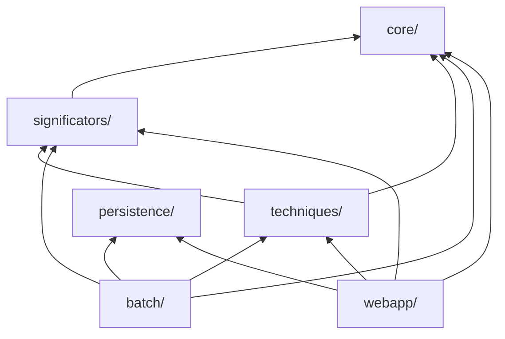

**Prepared as:** lead-architect migration plan **Primary reference:** `DEVELOPER_MANUAL.md` (reverse-engineered architecture manual) **Canonical source:** merged codebase snapshot (`repomix-output-Topo_Astro_Clone_zip.md`) **Scope of this document:** planning only — no implementation code is included.

## Revision Notes (v1 → v2)

You corrected a real misunderstanding in v1, and this version is rebuilt around the fix, not just patched. Specifically:

1. **"Not currently called" is not a synonym for "dead."** v1 recommended outright deletion of several functions on the grounds of zero callers. That was wrong. §2 below establishes the actual rule this version follows, and every phase has been re-derived from it — most of what v1 marked "delete" is now "relocate, fix if trivially broken, and keep importable" instead.
2. I went back to the source for every item you flagged and re-verified each one individually rather than re-applying a blanket rule — the findings for `get_directed_from_data`, `get_str_only_aspects_from_data`, and the Harmonics getter are below in §2.2–§2.4, with the actual evidence, not just a restated conclusion.
3. Phase 11's seven items are now **resolved**, per your numbered decisions, not still "pending your approval." Phase 11 now explains where each decision's execution actually landed in the roadmap (most moved earlier, into Phases 4 and 8, because that's where they're contextually cheapest to do correctly).
4. Phase 2 now contains the exhaustive test-target list you asked for.
5. A documentation standard (§3.3) is now a first-class requirement threaded through every phase from Phase 3 onward, not deferred to the end.
6. Every phase's task list is rewritten to be concrete enough to hand to a coding agent directly — exact current names, exact destinations, exact nature of each change.

## How to use this document

- Work through the phases **in order**; each assumes the previous ones are complete.
- Every phase has a **Validation Checklist**. Do not start the next phase until it passes in full.
- "Files/Modules Affected" uses the **current flat filenames** for Phases 1–3, and the **new package paths** (§3) from Phase 4 onward.
- No code is included anywhere, only descriptions of what to change and why — precise enough to execute, but planning-level.

---

## Table of Contents

1. [Assessment of the Current Architecture](https://claude.ai/chat/95b3d20f-4a89-4534-8eb0-50f33767a690#1-assessment-of-the-current-architecture)
2. [What Gets Preserved vs. Removed, and Why](https://claude.ai/chat/95b3d20f-4a89-4534-8eb0-50f33767a690#2-what-gets-preserved-vs-removed-and-why)
3. [Recommended Target Architecture](https://claude.ai/chat/95b3d20f-4a89-4534-8eb0-50f33767a690#3-recommended-target-architecture)
4. [Migration Roadmap Overview](https://claude.ai/chat/95b3d20f-4a89-4534-8eb0-50f33767a690#4-migration-roadmap-overview)
5. [Phase 1 — Stabilize the Current Tree](https://claude.ai/chat/95b3d20f-4a89-4534-8eb0-50f33767a690#phase-1--stabilize-the-current-tree)
6. [Phase 2 — Characterization Test Harness](https://claude.ai/chat/95b3d20f-4a89-4534-8eb0-50f33767a690#phase-2--characterization-test-harness)
7. [Phase 3 — De-duplication (Enums & Shadowed Imports)](https://claude.ai/chat/95b3d20f-4a89-4534-8eb0-50f33767a690#phase-3--de-duplication-enums--shadowed-imports)
8. [Phase 4 — Package Skeleton, Mechanical Move & Reserve/Drafts Setup](https://claude.ai/chat/95b3d20f-4a89-4534-8eb0-50f33767a690#phase-4--package-skeleton-mechanical-move--reservedrafts-setup)
9. [Phase 5 — Extract the Significator & Scoring Engine](https://claude.ai/chat/95b3d20f-4a89-4534-8eb0-50f33767a690#phase-5--extract-the-significator--scoring-engine)
10. [Phase 6 — Normalize What's Actually Common Across Techniques](https://claude.ai/chat/95b3d20f-4a89-4534-8eb0-50f33767a690#phase-6--normalize-whats-actually-common-across-techniques)
11. [Phase 7 — Eliminate Hidden Global State](https://claude.ai/chat/95b3d20f-4a89-4534-8eb0-50f33767a690#phase-7--eliminate-hidden-global-state)
12. [Phase 8 — Flask Layer Modularization & Charting Resolution](https://claude.ai/chat/95b3d20f-4a89-4534-8eb0-50f33767a690#phase-8--flask-layer-modularization--charting-resolution)
13. [Phase 9 — Formalize the Aspect Data Model](https://claude.ai/chat/95b3d20f-4a89-4534-8eb0-50f33767a690#phase-9--formalize-the-aspect-data-model)
14. [Phase 10 — Batch Mode CLI](https://claude.ai/chat/95b3d20f-4a89-4534-8eb0-50f33767a690#phase-10--batch-mode-cli)
15. [Phase 11 — Legacy Directory & Branch Cleanup](https://claude.ai/chat/95b3d20f-4a89-4534-8eb0-50f33767a690#phase-11--legacy-directory--branch-cleanup)
16. [Phase 12 — Documentation, Tooling & Long-Term Hygiene](https://claude.ai/chat/95b3d20f-4a89-4534-8eb0-50f33767a690#phase-12--documentation-tooling--long-term-hygiene)

---

## 1. Assessment of the Current Architecture

### Strengths worth preserving deliberately

- **The domain core is already framework-agnostic.** `constants.py`, `aspects_base.py`, `pd_base.py`, and the seven technique modules have zero awareness of Flask, argparse, or file I/O orchestration. This is the most important boundary a clean architecture needs, and it already exists — the migration formalizes and protects it rather than inventing it.
- **The "mini-class per technique" pattern is a real, working encapsulation instinct.** Each technique already exposes itself as a self-contained object built from a radix.
- **The aspect-string format is a genuine, if fragile, integration success** — every consumer (GUI, batch counters, saved selections, Excel export) is decoupled from any single producer's internal representation because they all speak the same string grammar.
- **The significator/scoring system is deep, validated domain research**, not accidental complexity.
- **Every technique-specific quirk turns out to have a real reason behind it once you look closely** — this review found none of the seven techniques' "special-case" behavior to be accidental. Harmonics returns a single aspect string instead of a (direct, converse) pair because a harmonic chart genuinely has no converse; Lunar's accessors look nothing like the other six because one `Lunar_Auto` instantiation computes multiple cyclic-return charts at once, not one calculation like everything else. Both are permanent, technique-intrinsic facts, not bugs (§2.3–§2.4).
- **The two operating modes (interactive Flask GUI, offline batch scanning) already share the same calculation core.**

### Key areas for improvement

- **No package structure** — fifteen modules at the repository root, importing each other as flat siblings.
- **Three separate, inconsistent "technique type" enumerations**, one of which causes a real latent `AttributeError` on the SRA branch.
- **The significator/scoring engine — used by five of the seven techniques — lives inside the file named after one specific technique.**
- **Two real inconsistencies in the technique-class contracts that are genuine duplication, not technique-specific facts** — see §2.5 for exactly which ones qualify and which don't.
- **Hidden global mutable state in two independent subsystems** — the well-known instance in `app.py`, and an undocumented second instance inside the batch engine.
- **Aspect data is never a first-class value** — built as a formatted string and re-parsed by regex/string-splitting at six-plus independent sites.
- **Redundant environment configuration** — `swe.set_ephe_path(...)` called identically in eight files.
- **Zero automated tests, zero CI, no dependency manifest.**
- **A working chart-rendering approach (kerykeion-based) and a non-working one (client-side `astrochart.js`) currently sit tangled together**, making the whole area look uniformly broken when only half of it is.
- **The offline batch mode has no CLI.**
- **No consistent docstring convention** — some functions (`calc_alt`, `calc_lst`) already model a good one; most of the codebase has none.

None of the above are reasons to rewrite; they are the addressable targets of the roadmap below.

---

## 2. What Gets Preserved vs. Removed, and Why

### 2.1 The rule this plan actually follows

A function or module is a candidate for **removal** only if one of these two things is true:

- **(a) Genuine duplication** — the exact same logic already exists, in active use, somewhere else. Example: three technique-type enums that should be one; `app.py`'s local re-definitions of `parse_selection_file`/`get_technique_name`, which are near-identical copies of the versions already imported from `constants.py`.
- **(b) Pure mechanism, not logic** — the function exists only to manage an architectural pattern that is itself being removed, and has no standalone computational value once that pattern is gone. The one confirmed example is `reset_globals()` — once the values it resets are no longer module globals (Phase 7), there is nothing left to reset. This is categorically different from a function that computes something.

**Everything else is preserved, not deleted** — including every function this review confirmed has zero current callers, unless it separately meets test (a) or (b) above. "Preserved" means: kept, fixed if trivially broken, relocated to a clearly labeled, genuinely importable location, documented, and easy to wire into a future workflow. Sitting untouched at the repository root, as today, is not preservation — it's just where things happened to land. The point of this plan is to make preserved logic _more_ discoverable and reusable, not less.

### 2.2 Two places this review checked very specifically, and confirmed are real, working, worth keeping

- **`calc_alt`/`calc_lst`** (`pd_automate.py`) both carry full `Parameters:`/`Returns:` docstrings — real astronomical formulas (altitude from LST/RA/Dec/latitude; Local Sidereal Time from Julian Date and longitude), written with evident care, not scratch code. These are general-purpose astronomy utilities, not Primary-Directions-specific — they happen to live in `pd_automate.py` today but don't conceptually belong to it. They're relocated (Phase 4) to a general reserve area, not deleted.
- **`get_timezone_name_from_pos`** (`app.py`) is a small, complete, working utility (returns an IANA zone name for a lat/long) that is only unreferenced because the one place that used to call it (the `/generate_chart` route) currently has that call commented out, not because the function itself is broken. Relocated, not deleted.

### 2.3 `get_directed_from_data` (`pd_base.py`) — checked individually, genuinely distinct, not redundant

This function computes a directed longitude from **already-computed intermediate values** passed in directly (`GEO_LAT`, `DECL`, `RA`, `RAMC`, `mc`, `house_pos`, `ac`, `long`, `e`) — including its own copy of the MD-vs-SA quadrant-shift correction, with its own debug logging to `log_md_sa.txt`. This is a materially different calling convention from `PD_Automate`'s directed-position functions, which derive all of those intermediate values internally from a radix/event pair on every call. It is not a worse or older copy of the same thing — it's a lower-level, composable entry point for a scenario where those intermediate values are already available (for example, a future batch pipeline that caches RA/DECL/RAMC across many events for one radix, to avoid recomputing them from the ephemeris each time). That's a real, plausible future use, not redundant with anything the current `PD_Automate` class does. **Verdict: preserve.**

### 2.4 Lunar and Harmonics — confirmed technique-intrinsic, not inconsistencies to fix

**Harmonics genuinely cannot produce a `(direct, converse)` pair.** `Harmonics_Auto.calc_harmonics_for_date` computes a single derived "harmonic chart" — each radix planet's degree multiplied by the years elapsed between radix and event — and calls `find_trans_swiss_aspects` exactly once, between the radix positions and that one derived harmonic position set. There is no second, inverse harmonic calculation anywhere in the class. Classical harmonic technique doesn't have a natural "converse" the way arc-based techniques (Primary Directions, Secondary Progressions) do — a harmonic chart is a single derived chart, full stop. `get_str_aspects()`'s single-string return isn't an unfinished version of the other six techniques' pattern; it's the correct shape for what this technique actually computes. **This is not touched — it's documented and preserved as-is.**

**Lunar's shape is different because one instantiation computes multiple charts, not one.** `Lunar_Auto.__init__` calls `calc_lunar_for_date` three times internally — once each for `LunarType.LUNAR`, `KINETIC`, and `AS_LUNAR` — concatenating all the results (each of which can itself expand to a direct/demi-direct/converse/demi-converse sub-chart) into one combined list. No other technique in this system works that way; every other technique computes exactly one calculation per instantiation. `get_all_lunars()` (a list of labeled sub-charts) and `get_info()` (a dict keyed by lunar-type) are the correct, technique-specific shapes for that — not a naming inconsistency to fix. **This is not touched — it's documented and preserved as-is**, including in Phase 6, where the getter-naming unification explicitly excludes Lunar and Harmonics for exactly this reason.

**`get_str_only_aspects_from_data` (`lunar_auto.py`) — checked its intention specifically, and it is not redundant.** As written, it calls `Lunar_Auto(dt_radix, dt_event, geopos, geopos_natal, ltype, orb)` — six positional arguments — against a constructor that only accepts five (`dt_radix, dt_event, geopos, geopos_natal, orb`, no `ltype`). This is a genuine bug: it cannot execute successfully as written. But its _purpose_ is not redundant with anything currently working: it's meant to return a **flattened, unlabeled** string of every lunar-return's aspects, as an alternative to `get_str_labelled_aspects_from_array` (the labeled version, which keeps each sub-chart's header and is what `app.py` and `count_mal_ben_all_lunars` actually use today). The unlabeled variant is never successfully produced anywhere else in the codebase — the only two places that ever call `get_str_only_aspects_from_array` (the actual flattening logic underneath the broken wrapper) are this same broken wrapper, and an inert, triple-quoted scratch block at the very bottom of the file that never executes. So this is a second, genuinely distinct output shape for Lunar data (unlabeled vs. labeled) that Lunar was evidently designed to offer, currently broken by a simple argument mismatch. **Verdict: fix the argument mismatch and keep it as a first-class, working, alternative accessor on `Lunar_Auto` — not a "reserve" shelf item, an active part of the technique's own intended interface, the same way it already offers both a labeled and an (until now, broken) unlabeled aspect view.**

### 2.5 What genuinely is duplication, and stays scheduled for removal

- **Three technique-type enumerations** (`constants.aTechniqueType`, an incomplete 5-member copy in `process_techniques_files.py`, a differently-cased 4-member copy in `csv_analysis.py`) — you agreed this one doesn't lose anything by unifying, and it also happens to fix a real latent `AttributeError` on the SRA branch as a side effect.
- **`app.py`'s local re-definitions of `parse_selection_file` and `get_technique_name`** — verified to be near-identical to the versions already imported from `constants.py` (the only difference is one extra debug `print` statement). Genuine duplication, not a distinct capability.
- **`aspects_base.MAJOR_ASPECTS`** as a separately hand-maintained copy of five entries from `ALL_ASPECTS` — genuine duplication of data, not logic.
- **`reset_globals()`** — the one function this review confirms is pure mechanism (§2.1(b)), not logic, tied directly to the global-state removal in Phase 7.

Everything else this review found with zero current callers is in §2.2–§2.4 above, and is preserved, not removed.

---

## 3. Recommended Target Architecture

### 3.1 Directory layout

Data directories keep their existing names/formats — only their parent location moves. Two new top-level ideas are added specifically to hold what §2 preserves: a `reserve.py` convention (complete, working, currently-unwired logic, living as close as possible to the code it's conceptually related to) and a `drafts/` directory (incomplete, non-executing sketches, kept outside the installable package since they don't parse).

```
topocentric-astro/
├── pyproject.toml
├── README.md
├── DEVELOPER_MANUAL.md
├── .gitignore
├── data/
│   ├── data_input/
│   ├── data_rect/
│   ├── data_times/
│   └── saved_selections/
├── drafts/                                 # NEW — incomplete, non-executing sketches; NOT part of the installable package
│   ├── README.md                            # explains the convention: reference/starting-point only, not expected to import
│   └── pd_assist.py                          # kept exactly as-is (still won't parse) — retained per your decision, Phase 11
├── scripts/                                 # Phase 10 — CLI entry points
├── tests/
│   ├── fixtures/                             # Phase 2 — golden-master inputs & outputs
│   └── ...                                   # characterization suite
└── src/
    └── topo_astro/
        ├── core/
        │   ├── constants.py
        │   ├── aspects.py                     # ex aspects_base.py; find_trans_aspects stays here, clearly marked (§2, Phase 9)
        │   ├── geocoding.py
        │   └── reserve.py                     # NEW — calc_alt, calc_lst, add_suffix_to_tuples (§2.2)
        ├── techniques/
        │   ├── base.py                        # shared dispatcher-construction interface (Phase 6) — NOT a forced-uniform getter API
        │   ├── primary_directions/
        │   │   ├── trig.py                     # ex pd_base.py
        │   │   ├── technique.py                # ex pd_automate.py, PD-specific orchestration only
        │   │   └── reserve.py                  # NEW — get_directed_from_data (§2.3)
        │   ├── secondary_progressions.py
        │   ├── pssr.py
        │   ├── transits.py
        │   ├── sra.py
        │   ├── harmonics.py                    # get_str_aspects()'s single-value return is UNCHANGED — see §2.4
        │   └── lunars.py                       # get_all_lunars()/get_info() UNCHANGED; get_str_only_aspects fixed & kept live — see §2.4
        ├── significators/
        │   ├── rules_data.py
        │   └── scoring.py
        ├── batch/
        │   ├── grid_engine.py
        │   ├── candidate_times.py
        │   ├── aspect_counting.py
        │   ├── convergence.py
        │   ├── excel_export.py
        │   ├── analysis.py                     # NEW — ex csv_analysis.py, kept fully & fixed per your decision, Phase 11
        │   └── entrypoints.py                  # ex main_techniques.py
        ├── persistence/
        │   └── selections.py
        └── webapp/
            ├── app_factory.py
            ├── utils.py
            ├── reserve/                        # NEW
            │   ├── timezone_name_lookup.py       # get_timezone_name_from_pos
            │   ├── clear_directory.py             # clear_directory
            │   ├── custom_action_prototype.py     # the /custom_action route — purpose uncertain, preserved (Phase 8)
            │   └── charting_kerykeion/            # the working-but-shelved chart approach — kept per your decision, Phases 11 & 8
            │       ├── routes.py
            │       ├── README.md
            │       └── examples/                   # 2 SVGs + template variant retrieved from the old-push branch
            ├── routes/
            │   ├── main.py
            │   ├── content.py
            │   └── selections.py                  # no charts.py among the ACTIVE routes — see Phase 8
            ├── static/
            │   └── js/                             # project-owned JS only — astrochart.js removed entirely (Phases 8 & 11)
            └── templates/
                └── index.html
```

### 3.2 Dependency direction



`core/` has no outgoing dependencies on the rest of the package. `drafts/` sits outside this graph entirely — it isn't imported by anything, by design.

### 3.3 Documentation standard (applies from Phase 3 onward)

The codebase already models a good convention in `calc_alt`/`calc_lst` — this plan adopts it as the house style rather than inventing a new one:

- **Every module**, once touched by a phase, gets a module-level docstring stating: what this module is responsible for, which architectural layer it belongs to (per §3.1), and — for anything relocated from elsewhere — where it came from and why it lives here now.
- **Every function/method**, once touched, gets: a one-line summary, a `Parameters:` block (name, type, description) if it takes any, and a `Returns:` block describing the shape of what comes back. This matches the existing `calc_alt`/`calc_lst` convention exactly.
- **Every `reserve.py` file and every file under `drafts/`** additionally gets an explicit note on _why_ it's there and _what would need to happen_ to wire it back into active use — this is the difference between "preserved" and "just moved."
- This is not a separate phase. From Phase 3 onward, every phase's task list includes "add/complete docstrings for every file touched in this phase," so the work lands incrementally, alongside the structural changes, not as a final catch-up pass.

---

## 4. Migration Roadmap Overview

|#|Phase|Risk|One-line objective|
|---|---|---|---|
|1|[Stabilize the Current Tree](https://claude.ai/chat/95b3d20f-4a89-4534-8eb0-50f33767a690#phase-1--stabilize-the-current-tree)|Low|Remove the live side-effect call, pin dependencies, centralize the ephemeris path, safety-copy at-risk branch content|
|2|[Characterization Test Harness](https://claude.ai/chat/95b3d20f-4a89-4534-8eb0-50f33767a690#phase-2--characterization-test-harness)|Low|Capture current behavior as an automated regression baseline — exhaustive target list|
|3|[De-duplication](https://claude.ai/chat/95b3d20f-4a89-4534-8eb0-50f33767a690#phase-3--de-duplication-enums--shadowed-imports)|Medium|Consolidate the three technique-type enums; remove the shadowed `app.py` functions|
|4|[Package Skeleton, Move & Reserve/Drafts Setup](https://claude.ai/chat/95b3d20f-4a89-4534-8eb0-50f33767a690#phase-4--package-skeleton-mechanical-move--reservedrafts-setup)|Medium|Introduce `src/topo_astro/…`; relocate every file, including all preserved-but-unwired logic to its labeled home|
|5|[Extract Significator & Scoring Engine](https://claude.ai/chat/95b3d20f-4a89-4534-8eb0-50f33767a690#phase-5--extract-the-significator--scoring-engine)|Medium|Split shared scoring logic out of the PD module|
|6|[Normalize What's Actually Common](https://claude.ai/chat/95b3d20f-4a89-4534-8eb0-50f33767a690#phase-6--normalize-whats-actually-common-across-techniques)|High|Unify the 5 techniques that share a real shape; explicitly preserve Lunar and Harmonics as-is|
|7|[Eliminate Hidden Global State](https://claude.ai/chat/95b3d20f-4a89-4534-8eb0-50f33767a690#phase-7--eliminate-hidden-global-state)|High|Remove globals from `app.py` and the batch grid engine; retire `reset_globals`/`resetvars`|
|8|[Flask Modularization & Charting Resolution](https://claude.ai/chat/95b3d20f-4a89-4534-8eb0-50f33767a690#phase-8--flask-layer-modularization--charting-resolution)|Medium|App factory + route blueprints; execute the kerykeion-keep / astrochart.js-remove split|
|9|[Formalize the Aspect Data Model](https://claude.ai/chat/95b3d20f-4a89-4534-8eb0-50f33767a690#phase-9--formalize-the-aspect-data-model)|Critical|Real `Aspect` structure; string format becomes a codec at I/O boundaries|
|10|[Batch Mode CLI](https://claude.ai/chat/95b3d20f-4a89-4534-8eb0-50f33767a690#phase-10--batch-mode-cli)|Low|Real command-line entry points, including for the kept-in-full analysis module|
|11|[Legacy Directory & Branch Cleanup](https://claude.ai/chat/95b3d20f-4a89-4534-8eb0-50f33767a690#phase-11--legacy-directory--branch-cleanup)|Low|`temptemp` deletion, `txt/` archival, git branch cleanup — the small remainder of what used to be an open decision list|
|12|[Documentation, Tooling & Long-Term Hygiene](https://claude.ai/chat/95b3d20f-4a89-4534-8eb0-50f33767a690#phase-12--documentation-tooling--long-term-hygiene)|Low|Update README/manual, add CI, final docstring audit|

Phases 1→9 happen in order. Phase 10 depends on 9. Phase 11 has no hard dependency on anything and can be done whenever convenient. Phase 12 is last by definition.

---

## Phase 1 — Stabilize the Current Tree

**Objective:** Make the existing flat codebase safe and reproducible, and get one specific at-risk asset off a branch that could disappear, before any other work starts.

**Rationale:** Nothing downstream is safe to build on a codebase that performs an unrequested file write (or crashes) on import, has no reproducible dependency set, and has one piece of content you specifically want kept (the working kerykeion chart code + its example outputs) sitting only on a stale git branch that Phase 11 is going to clean up. Retrieving that now, before anything else, removes any risk of losing it to an accidental branch deletion somewhere in the weeks this migration will take.

**Files/Modules Affected:** `process_techniques_files.py`; `setup.sh`; the eight files calling `swe.set_ephe_path`; the `old-push` git branch (read-only checkout, not modified).

**Tasks:**

1. Remove the uncommented `sort_polaris_times(...)` call at the very end of `process_techniques_files.py`. It is a verification artifact (the trace of confirming the fix mentioned in your brief), not a feature — confirm it produces no output anything currently depends on, then delete the line.
2. Check out the `old-push` branch read-only and copy out exactly three things into a temporary safe-holding folder (e.g. `_archive/old-push-kerykeion/` at the repo root, or anywhere outside the repo you're confident won't be cleaned up): the two rendered chart SVGs, and the kerykeion-specific HTML template variant. This is purely a safety copy — final placement into `webapp/reserve/charting_kerykeion/` happens in Phase 8. Do not delete or modify the `old-push` branch itself yet — that's Phase 11, after Phase 8 has confirmed everything needed was retrieved.
3. Create a dependency manifest (`requirements.txt` or `pyproject.toml`) listing every real runtime dependency observed: `julian`, `pyswisseph`, `flask`, `timezonefinder`, `pandas`, `requests`, `python-dateutil` (correcting `setup.sh`'s `python-datautil` typo), `openpyxl`, `pytz` (used throughout `process_techniques_files.py`, currently absent from `setup.sh` entirely), and — since `csv_analysis.py` is being kept fully, not conditionally — `seaborn`, `matplotlib`, `numpy` as well, all included from the start.
4. Create one ephemeris-path configuration point and have the two real entry points (the Flask app, the batch entry point) call it once each, removing the other six redundant `swe.set_ephe_path(...)` call sites. Every call site sets the exact same path today, so this is a pure consolidation with no branching to reason about.
5. Update `setup.sh` to install from the new manifest instead of its own inline `pip install` line.
6. Do not touch any calculation logic, class structure, or file layout beyond the above.

**Expected Architectural Benefits:** A codebase that's safely importable/runnable from a clean environment; one reproducible dependency set that already accounts for every module being kept; one point of control for ephemeris configuration; the one time-sensitive preservation task (old-push's kerykeion content) is safe before anything else begins.

**Risk Level:** Low. Every change is a deletion of code with zero legitimate callers, a purely additive manifest/safety-copy, or a mechanical consolidation of eight identical calls into one.

**Validation Checklist:**

- [x] `import process_techniques_files` succeeds with no file-write side effects, from a clean working directory.
- [x] The safety-copy folder contains the two SVGs and the template variant, confirmed openable/viewable.
- [x] A fresh virtual environment built from the new manifest boots `app.py` and serves the home page.
- [x] One full interactive cycle (pick a file, a candidate time, an event, the PD technique) produces aspects, confirming the ephemeris-path consolidation didn't disturb Swiss Ephemeris calculations.
- [x] Diff review confirms the only changed lines are the eight `set_ephe_path` call sites and the deleted trailing call.

**Suggested Commit Message:** `chore: stabilize environment, pin dependencies, centralize ephemeris path, safety-copy old-push kerykeion assets`

---

## Phase 2 — Characterization Test Harness

**Objective:** Capture the current, verified behavior of every layer of the system as an automated regression baseline, before any structural change begins.

**Rationale:** The entire premise of this migration is 100% behavior preservation. Manual spot-checking cannot reliably validate twelve phases, especially the deepest ones (5, 6, 7, 9). Below is the exhaustive list of what needs a test, organized by layer — not a sample, the actual target list.

**Files/Modules Affected:** New `tests/` directory only. No existing files change.

**Fixture setup (do this first):**

- [x] Select 2–3 real people from `data_input/` with well-populated event lists, including the one the manual identifies as most-iterated, plus at least one person who already has a real `saved_selections/*.txt` file to cross-check against.
- [x] Select 3–5 fixed candidate radix datetimes per person, spanning both known and hypothetical DOBs, including at least one non-UTC, non-zero-DST-offset location to properly exercise timezone-dependent code.

**Core layer:**

- [x] `calc_planets_labelled`/`calc_planets_pof_houses_labelled`: correct planet/degree/label tuples for a fixture radix; Part-of-Fortune day-formula and night-formula branches each tested once.
- [x] `calc_planets_near_angles`: orb-boundary behavior — one case just inside the threshold, one just outside.
- [x] The altitude/geocoding cache: one cache-hit case, one cache-miss (new coordinate) case.
- [x] The aspect-matching function in `aspects_base.py`: one test per entry in `ALL_ASPECTS`, each at exactly its orb boundary (just inside = match, just outside = no match), plus the 0°/360° wraparound case for conjunction.
- [x] `find_trans_swiss_aspects`: a known pair of planet-position lists → an expected aspect string.
- [x] `find_trans_aspects` (the reserved alternate finder, §2): same fixture, confirming sensible output under its caller-supplied-orb design.
- [x] `MAJOR_ASPECTS` vs. `ALL_ASPECTS`: confirm the same 5 entries appear both before and after Phase 3's de-duplication.

**Primary Directions:**

- [x] The trig core (RA/Decl, ADP, OA/OD, MD/SA-equivalent functions in `pd_base.py`): one test per function against a hand-verified numeric example.
- [x] The Naibod-key arc-to-time conversion.
- [x] The MD > SA quadrant-shift correction path: a fixture specifically chosen to trigger this branch (this is where Bug #1 lives per the manual — it needs its own dedicated case, not incidental coverage).
- [x] `calc_directed_pd_houses`, `calc_directed_pd_planets`, `calc_directed_POF`, `calc_radix_ac_mc_ramc`, `calc_rad_planets_equatorial`: one test each against a fixture.
- [x] Direct-arc and converse-arc output for at least one angular and one non-angular significator.
- [x] `get_aspects_str()`/`get_extended_information()` full contract.

**Significators & scoring:**

- [x] `is_acceptable_angular_aspect`: one true-positive, one true-negative.
- [x] `is_acceptable_planet_combo`: one combo present in `PLANETARY_COMBO`, one absent.
- [x] `is_acceptable_pd_aspect`: at least one case per `AspectType` branch.
- [x] `count_pd_score_acceptable_aspects`/`count_event_acceptable_aspects`: at least one `EventType` from each `GoodBadFlag` category (GOOD and BAD), asserting both the accepted-aspect list and the numeric score.

**Each technique module:**

- [x] Secondary, PSSR, Transit, SRA: direct + converse aspect string output and info-dict contents against a fixture, for each.
- [x] Harmonics: the single-string aspect output (not a tuple) against a fixture; the harmonic-degree math (years-elapsed × radix-degree) against a hand-computed value.
- [x] Lunar: `get_all_lunars()`'s full labeled sub-chart list against a fixture (covering however many of L/DL/LC/DLC, K/DK/KC/DKC, A/DA/AC/DAC labels that fixture's demi-return conditions trigger); `get_info()`'s nested per-lunar-type dict; the demi-return trigger threshold (the >14-day condition) at its boundary; `count_mal_ben_all_lunars`'s malefic/benefic tally; the **fixed** `get_str_only_aspects_from_data`'s flattened, unlabeled output against the same fixture, confirmed to carry the same underlying aspect content as the labeled version, just without the section headers.

**Batch engine:**

- [x] `generate_hourly_datetimes`: exactly 288 five-minute steps across a 24-hour span; the local-midnight anchor correctly reflects the geopos-derived UTC offset for the non-UTC fixture location.
- [x] `sort_polaris_times` (post-fix): correct descending sort by the "A value" column; correct threshold filtering; the not-enough-times-for-that-count early-return path.
- [x] `generate_grid_angular_aspects`/`generate_grid_times_manual`/`append_grid_acceptable_angles`: one full fixture run producing an exact expected grid file.
- [x] Two full batch runs back-to-back in the same process, confirming (on the _pre-Phase-7_ code) that `resetvars()` is currently required to avoid state leakage between them — this becomes the baseline that Phase 7 must continue to satisfy once the globals are gone.
- [x] `categorize_aspect`, `count_extended_aspect_groups_txt`, and (while it still exists, pre-Phase-11 consolidation) `count_aspect_groups_txt`.
- [x] The `sum_sec_prim` convergence family: a fixed pair of input files → an expected combined output.
- [x] `create_analysis_workbook`: `sanitize_sheet_name`, `abbreviate_aspect_string`, and actual cell values for a small fixed fixture.

**Persistence:**

- [x] `parse_selection_file` against **both** existing real files in `saved_selections/`, confirming the exact expected nested dictionary for each.
- [x] The selection-save path, against a fixed input, confirming exact file content.

**Web layer (via Flask test client):**

- [x] Each of the 6 routes: request shape in, response shape out, for one representative case each.
- [x] `get_aspect_str_orb`: orb-based trimming at the boundary.
- [x] `get_technique_name`/`sanitize_filename`: one representative case each.

**Batch analysis (`csv_analysis.py`, being kept fully):**

- [x] This module has zero current callers, so there's no existing invocation to freeze as a baseline the normal way. Include a basic import/smoke test only (confirms it parses, and that its enum reference doesn't crash once pointed at the canonical enum in Phase 3). Flag explicitly — don't silently skip — that real behavioral characterization for this module is deferred until it's first exercised for real, likely once it gets a CLI entry point in Phase 10.

**Expected Architectural Benefits:** An objective, fast, automatic way to prove "nothing changed" after every subsequent phase.

**Risk Level:** Low. Purely additive; the main risk is under-investing in fixture coverage, not breakage.

**Validation Checklist:**

- [x] Every bullet above has a corresponding passing test against the Phase-1-stabilized code.
- [x] Golden outputs are committed as frozen files, not regenerated at test time.

**Suggested Commit Message:** `test: add exhaustive characterization test suite capturing current behavior as regression baseline`

---

## Phase 3 — De-duplication (Enums & Shadowed Imports)

**Objective:** Remove only the items confirmed as genuine duplication (§2.5) — nothing else — still within the current flat file layout.

**Rationale:** This is intentionally narrow now. Doing it before the package move (Phase 4) means every file arriving in its new home in Phase 4 is already final. It also resolves the latent `TechniqueType.SRA` `AttributeError` as a side effect of consolidating enums, with no dedicated bug-fix phase needed.

**Files/Modules Affected:** `constants.py`, `process_techniques_files.py`, `app.py`, `aspects_base.py`.

**Tasks:**

1. Standardize on `constants.aTechniqueType` as the single technique-type enum. Update `process_techniques_files.py` to import and use it directly instead of its own incomplete local `TechniqueType` — this removes the `AttributeError` risk on the SRA branch entirely, since the canonical enum defines `SRA` and the local one didn't.
2. Leave `csv_analysis.py`'s own `TechniqueType` alone in this phase — its enum reference gets updated in Phase 4, alongside its relocation to `batch/analysis.py`, so that work happens exactly once rather than twice.
3. Remove `app.py`'s local re-definitions of `parse_selection_file` and `get_technique_name`; rely on the versions already imported from `constants.py`. Before removing, diff both pairs one more time to reconfirm no behavioral divergence — the only known difference is one extra debug `print` in `app.py`'s copy of `parse_selection_file`, affecting only server logs.
4. Consolidate `aspects_base.MAJOR_ASPECTS` to be derived from `ALL_ASPECTS` (filtered to the five major aspect names) instead of maintained as a second, separately hand-copied dictionary.
5. Do **not** touch anything else — every other zero-caller function identified in this review is out of scope for this phase; see §2 and Phase 4.
6. Add/complete docstrings (per §3.3) for every file touched in this phase: `constants.py`, `process_techniques_files.py`, `app.py`, `aspects_base.py`.

**Expected Architectural Benefits:** One canonical technique-type enum; `app.py`'s behavior now fully explained by its actual imports; zero information lost.

**Risk Level:** Medium. Dead-duplicate removal is low risk in isolation, but the enum consolidation touches a real control-flow branch (the batch engine's technique dispatch) and must be verified against the Phase 2 suite, especially the previously-unreachable SRA path.

**Validation Checklist:**

- [x] Full characterization suite passes unchanged.
- [x] A batch run including the SRA technique — previously impossible due to the `AttributeError` — now completes; its output is manually reviewed once against a hand-computed expectation, since Phase 2's suite could not have captured previously-crashing behavior as a baseline.
- [x] Manual smoke test confirms selections still save/load correctly after the shadow-import removal.
- [x] Every file touched in this phase has a module docstring and updated function docstrings per §3.3.

**Suggested Commit Message:** `refactor: consolidate technique-type enums, remove shadowed duplicate functions in app.py`

---

## Phase 4 — Package Skeleton, Mechanical Move & Reserve/Drafts Setup

**Objective:** Introduce the `src/topo_astro/…` layout from §3.1, relocate every existing module into it, and place every function/module preserved under §2 into its labeled home — all in one mechanical pass, since both kinds of move are "change the file's address, not its behavior."

**Rationale:** Doing the reserve/drafts relocation _here_, alongside the general package move, means it happens exactly once, with the same category of low-behavioral-risk mechanical change as the rest of this phase — rather than as a separate, later effort that re-touches files Phase 4 already moved.

**Files/Modules Affected:** every Python file in the repository; `csv_analysis.py`; `pd_assist.py`; new `src/topo_astro/` tree; new `drafts/` directory.

**Tasks — primary "happy path" relocations:**

1. Create the package skeleton with empty `__init__.py` files per §3.1.
2. Move `constants.py`→`core/constants.py`; `aspects_base.py`→`core/aspects.py` (`find_trans_aspects` moves with it, staying alongside `find_trans_swiss_aspects` — see task 8 below); `pd_base.py`→`techniques/primary_directions/trig.py`; `pd_automate.py`→`techniques/primary_directions/technique.py`; `secondary_automate.py`→`techniques/secondary_progressions.py`; `pssr_swiss_auto.py`→`techniques/pssr.py`; `transit_swiss_auto.py`→`techniques/transits.py`; `sra_auto.py`→`techniques/sra.py`; `harmonics_auto.py`→`techniques/harmonics.py`; `lunar_auto.py`→`techniques/lunars.py`; `main_techniques.py`→`batch/entrypoints.py`; `process_techniques_files.py`→`batch/grid_engine.py` (kept as one file for now — the internal split into `candidate_times.py`/`aspect_counting.py`/`convergence.py`/`excel_export.py` shown in §3.1 happens gradually across Phases 5–9 as each concern is actually touched); `app.py`→`webapp/app.py` (single file for now; blueprint split is Phase 8).
3. Move `templates/`→`webapp/templates/` and `static/`→`webapp/static/`. Do **not** create a `vendor/astrochart/` subfolder — `astrochart.js` is being removed entirely in Phase 8, not relocated.
4. Update every import statement to match. Update the Flask app's `template_folder`/`static_folder` configuration.
5. Move `data_input/`, `data_rect/`, `data_times/`, `saved_selections/` under the new `data/` parent, format unchanged.

**Tasks — reserve/drafts relocations (§2):** 6. Move `calc_alt`, `calc_lst`, `add_suffix_to_tuples` from `pd_automate.py`/`technique.py` into new `core/reserve.py`. These are general astronomy/utility functions, not PD-specific — this is a genuine re-homing to where they conceptually belong, not just a parking spot. 7. Move `get_directed_from_data` from `pd_base.py`/`trig.py` into new `techniques/primary_directions/reserve.py`. 8. Within `core/aspects.py`, keep `find_trans_aspects` in the same file as `find_trans_swiss_aspects` (they're tightly related — same domain, same module, just a different orb-sourcing strategy). Add a clear docstring/section marker distinguishing "in use" from "alternate, currently unused, caller-supplied-orb variant, kept for a possible future use needing uniform orb comparisons." 9. In `techniques/lunars.py` (ex `lunar_auto.py`): fix `get_str_only_aspects_from_data`'s argument mismatch — remove the stray `ltype` argument from its `Lunar_Auto(...)` construction call, and from its own function signature, matching the pattern already used correctly by the sibling function `count_mal_ben_all_lunars` (5 arguments, no `ltype`). Keep it in the main `lunars.py` file, as a live, working, alternative accessor — **not** in a `reserve.py` — since it represents an intentional part of Lunar's own dual-output design (labeled vs. unlabeled), not a shelved side-experiment (§2.4). 10. Move `get_timezone_name_from_pos` and `clear_directory` from `app.py` into new `webapp/reserve/timezone_name_lookup.py` and `webapp/reserve/clear_directory.py` respectively. 11. Move `csv_analysis.py` to `batch/analysis.py`. Update its local `TechniqueType` references to use the now-canonical `core.constants.aTechniqueType` (this is the point where that update happens, per the deferral noted in Phase 3, task 2). This is a genuine, fully-kept module — it lives among `batch/`'s other real modules, not in a reserve area. 12. Move `pd_assist.py`, unmodified, into a new top-level `drafts/pd_assist.py` (outside `src/`, since it still doesn't parse — see the note in task 13). Do not attempt to fix its syntax error as part of this phase; that's future feature work if you decide to pursue it, not a migration task. 13. Create `drafts/README.md` explaining the convention: this directory holds incomplete, non-executing sketches kept as a reference/starting point; nothing here is expected to import cleanly or is covered by the characterization suite.

**Tasks — remaining:** 14. Add/complete docstrings (§3.3) for every file touched, with particular attention to every new `reserve.py` and to `drafts/pd_assist.py`/`drafts/README.md` explicitly stating _why_ the code is there and what it would take to reactivate it. 15. Leave `temptemp` and the `txt/` legacy directory exactly where they are at the repository root for now (Phase 11).

**Expected Architectural Benefits:** A real, importable, navigable package; every function this review found across the codebase now has an honest, discoverable home reflecting what it actually is (in use, reserved-but-working, or a draft) instead of an accident of where it happened to be written.

**Risk Level:** Medium. Broad but mechanical — a missed import reference breaks loudly at import time (caught immediately by the test suite) rather than silently. The one non-mechanical change bundled into this phase is the Lunar constructor-argument fix (task 9), which is a small, well-understood, single-line correction, not a design change.

**Validation Checklist:**

- [X] Full characterization suite passes unchanged, now importing from the new package paths, including the newly-fixed Lunar unlabeled-aspects test from Phase 2.
- [X] The Flask app boots from its new location and serves the home page.
- [X] Repository-wide search confirms zero remaining old-style bare imports.
- [X] Every `reserve.py` file imports cleanly on its own (confirms the move didn't silently break something), even though nothing calls into it yet.
- [X] `drafts/pd_assist.py` is confirmed present and byte-identical to its pre-move version (still expected to fail to parse — that's fine, it's a draft).
- [X] `batch/analysis.py` imports cleanly with the canonical enum.
- [X] One full interactive cycle re-run manually in the browser.

**Suggested Commit Message:** `refactor: introduce src/ package layout; relocate all modules, including preserved reserve/draft items, to their labeled homes`

---

## Phase 5 — Extract the Significator & Scoring Engine

**Objective:** Split `techniques/primary_directions/technique.py` into three clearly separated concerns: PD-specific directed-position orchestration (stays), the hand-authored significator data tables (move), and the acceptance/scoring engine used by five of the seven techniques (move).

**Rationale:** The Developer Manual is explicit that `pd_automate.py`'s scoring functions are reused by Secondary, Transit, SRA, and Harmonics — only PSSR uses a different function, and Lunar/Natal use no scoring at all. Housing this shared engine inside the module named after one specific technique is the clearest case of "module boundary doesn't match responsibility" in the codebase.

**Files/Modules Affected:** `techniques/primary_directions/technique.py`; new `significators/rules_data.py` and `significators/scoring.py`; every current caller (`webapp/app.py`, `batch/grid_engine.py`, `batch/entrypoints.py`).

**Tasks:**

1. Move `EventType`, `AspectType`, `GoodBadFlag`, `Planet`, `PRIMARY_RULES`, `SECONDARY_RULES`, and `PLANETARY_COMBO` into `significators/rules_data.py`, as Python data structures for now (converting these hand-authored literals to JSON/YAML is optional future polish, not part of this phase — flagged for your own future consideration, not executed here).
2. Move the acceptance/scoring call graph (`is_acceptable_angular_aspect`, `is_acceptable_planet_combo`, `is_acceptable_pd_aspect`, `count_pd_score_acceptable_aspects`, `count_event_acceptable_aspects`, `is_aspect_conj_opp`, and supporting helpers) into `significators/scoring.py`, importing the data tables from `rules_data.py`.
3. Leave `PD_Automate` (the class) and the PD-specific directed-position functions (`calc_directed_pd_houses`, `calc_directed_pd_planets`, `calc_directed_POF`, `calc_rad_planets_equatorial`, `calc_radix_ac_mc_ramc`, `calc_planet_house_pos`) in `technique.py`.
4. Update every call site currently reaching these functions through the PD module's namespace to import from `significators.scoring`/`significators.rules_data` instead.
5. Copy function bodies verbatim — extraction and re-import only, no logic changes.
6. Add/complete docstrings (§3.3) for `technique.py`, `rules_data.py`, and `scoring.py`, with `rules_data.py`'s module docstring specifically noting that these tables are the hand-curated research core of the project and should not be edited casually.

**Expected Architectural Benefits:** The module other techniques currently reach into by name is replaced by an honestly-named, technique-agnostic module; the significator tables become a clearly labeled, independently viewable data asset.

**Risk Level:** Medium. Pure code motion, but the call graph is wide.

**Validation Checklist:**

- [X] Full characterization suite passes unchanged, with particular attention to the "Show Accepted"/scoring assertions for PD, Secondary, Transit, SRA, Harmonics, plus PSSR's separate scoring path.
- [X] Repository-wide search confirms zero remaining references to the old module-qualified call sites.
- [x] Manual interactive smoke test: toggle "Show Accepted" for each of the seven techniques plus Natal.
- [x] `rules_data.py` and `scoring.py` have module docstrings; every moved function retains or gains a docstring.

**Suggested Commit Message:** `refactor: extract significator rules and scoring engine out of primary_directions.technique into significators/`

---

## Phase 6 — Normalize What's Actually Common Across Techniques

**Objective:** Unify the getter method names **only** across the five techniques (Primary Directions, Secondary, PSSR, Transit, SRA) that genuinely share the same output shape, and replace the duplicated per-technique instantiation branching in `webapp/app.py` and `batch/grid_engine.py` with one shared dispatcher — while leaving Lunar's and Harmonics's own method names and shapes completely untouched, since §2.4 confirms both are permanent, technique-intrinsic facts, not inconsistencies.

**Rationale:** PD, Secondary, PSSR, Transit, and SRA all do the same conceptual job — given a radix and an event, produce a `(direct, converse)` pair of aspect strings and an info dict — but each was bootstrapped independently by copying an earlier module, leaving three different names for the same info-getter concept (`get_extended_information`, `get_dict_info` ×3, `get_info` ×1 for SRA) even though the _shape_ is identical across all five. Harmonics (single-value aspect output) and Lunar (multi-chart list output, nested-by-type info dict) are not that — forcing them into the same name as the other five would misrepresent what they actually return, exactly the mistake this plan is now careful not to make.

**Files/Modules Affected:** `techniques/primary_directions/technique.py`, `techniques/secondary_progressions.py`, `techniques/pssr.py`, `techniques/transits.py`, `techniques/sra.py` (the five being unified); new `techniques/base.py`; `webapp/app.py` (`update_content`); `batch/grid_engine.py` (`append_grid_acceptable_angles`); `batch/entrypoints.py`. **Not affected in their getter naming/shape:** `techniques/harmonics.py`, `techniques/lunars.py`.

**Tasks:**

1. For the five uniform techniques only, add a consistently-named pair of methods — recommend `get_aspects()` returning `(direct, converse)` and `get_info()` returning the extended-info dict (since SRA already uses `get_info()`, this is the naming choice that requires the fewest technique classes to change) — as thin wrappers around each class's existing method. Keep the original method names in place initially so nothing currently calling them breaks; the new names are additive at this stage.
2. Do **not** add or rename anything on `Harmonics_Auto` or `Lunar_Auto`. `Harmonics_Auto.get_str_aspects()` keeps returning its single string; `Lunar_Auto.get_all_lunars()`/`get_info()` keep their existing shapes. (Note: Lunar already happens to be named `get_info()` — this is a coincidence of naming, not evidence it should be treated like the five uniform techniques; its return shape is a nested per-lunar-type dict, structurally different from the other five's flat, one-calculation dict, and that difference is what matters, not the method name.)
3. Introduce one shared dispatcher — "instantiate the right technique for this radix/event/geopos combination" — that handles all seven techniques' constructor-shape differences (Julian day vs. datetime; single geopos vs. two floats; Lunar's extra natal-geopos/orb combination) in one place, replacing the near-identical branching chains currently duplicated in `update_content` and `append_grid_acceptable_angles`. The dispatcher's job is _construction_, not forcing a uniform accessor API afterward — once built, the caller still asks a PD/Secondary/PSSR/Transit/SRA object for `get_aspects()`/`get_info()`, but explicitly branches for Harmonics (`get_str_aspects()`, single value) and Lunar (`get_all_lunars()`, `get_info()`, multi-chart list) — exactly as today's code already has to, just consolidated from two duplicated branching blocks into one.
4. Update both call sites (`update_content`, `append_grid_acceptable_angles`) to use the shared dispatcher.
5. Once both call sites are confirmed working, decide whether to remove the now-superseded original method names on the five unified technique classes, or keep them as aliases — this specific removal is a judgment call for you (removing public methods, even internally-facing ones, is more opinionated than pure extraction), not something this phase does automatically.
6. Add/complete docstrings (§3.3) for `base.py` and every technique module touched, with `harmonics.py` and `lunars.py` specifically documenting _why_ they're excluded from the unification (cross-reference §2.4) so a future reader doesn't mistake the omission for an oversight.

**Expected Architectural Benefits:** One dispatcher instead of two independently-maintained, near-duplicate branching blocks; a predictable, consistent interface for the five techniques that genuinely share one; Lunar's and Harmonics's real differences are documented as permanent facts instead of being either silently glossed over or force-fitted into a shape that doesn't describe them.

**Risk Level:** High. This phase touches the actual instantiation of every technique across both the interactive and batch code paths. A subtle mistake in the dispatcher (e.g., mixing up which geopos a technique expects) would silently produce wrong astrological output rather than an obvious crash.

**Validation Checklist:**

- [ ] Full characterization suite passes unchanged for all seven techniques, direct and converse where applicable.
- [ ] Explicit side-by-side check: for at least one fixture, manually confirm the new dispatcher's raw aspect output is byte-identical to the pre-Phase-6 output for all seven techniques plus Natal.
- [ ] Specifically confirm `Harmonics_Auto.get_str_aspects()` still returns a single string (not a tuple, not coerced) and `Lunar_Auto.get_all_lunars()`/`get_info()` are entirely untouched — this is the check most specific to this phase's core risk (accidentally "fixing" a difference that was never a bug).
- [ ] Interactive smoke test across all eight radio-button options, with and without "Show Accepted"/"Show Data" toggled, and with an orb restriction applied.
- [ ] A full batch grid run reproduces byte-identical grid and `COUNT` output against the Phase 2 golden files.

**Suggested Commit Message:** `refactor: unify getter naming across the five uniform techniques; introduce shared dispatcher; leave Lunar and Harmonics untouched`

---

## Phase 7 — Eliminate Hidden Global State

**Objective:** Replace `webapp/app.py`'s module-level globals (`geo_pos_natal`, `dt_radix`, `lunar_orb`, `restrict_orb`, `current_file`, `selections_data`) and `batch/grid_engine.py`'s module-level globals (`grid_aspects`, `date_technique`, `aspect_type`) with explicit, passed-through state, and retire the two functions that exist solely to manage that state — `app.py`'s `reset_globals()` and `grid_engine.py`'s `resetvars()` — since §2.1(b) confirms both are pure mechanism with no logic to lose once the state they manage no longer exists.

**Rationale:** Both subsystems rely on hidden mutable state that couples otherwise-unrelated functions through side channels instead of arguments and return values. Doing this after Phase 6's dispatcher unification means the batch engine's per-call-site branching — which currently reads `date_technique`/`aspect_type` as globals — has already been consolidated into one place, making the explicit-parameter conversion mechanical.

**Files/Modules Affected:** `webapp/app.py` (all routes); `batch/grid_engine.py` (`generate_grid_angular_aspects`, `generate_grid_times_manual`, `append_grid_acceptable_angles`, `resetvars`); `batch/entrypoints.py` (the three orchestration functions currently calling `resetvars()`).

**Tasks:**

1. In `webapp/app.py`: introduce an explicit per-request/session state object (or thread the handful of values directly as parameters/return values) replacing the module globals. `selections_data` is the one value that genuinely needs to outlive a single request — keep it as a single, clearly-documented cache with an explicit lifetime, not a bare module global.
2. In `batch/grid_engine.py`: change `generate_grid_angular_aspects` and `generate_grid_times_manual` to build and return `grid_aspects` rows directly (or accept an explicit accumulator parameter); change `append_grid_acceptable_angles` to receive `date_technique`/`aspect_type` as explicit parameters.
3. Once both are converted, delete `resetvars()` and its three call sites in `batch/entrypoints.py`, and delete `app.py`'s `reset_globals()` — both are now provably unnecessary, not just unused.
4. Add/complete docstrings (§3.3) for every function whose signature changes in this phase, since the parameter list itself is now part of what needs explaining.

**Expected Architectural Benefits:** Both code paths become independently testable without a matching setup/reset dance; the "forgot to reset between runs" failure mode is eliminated by construction instead of by convention.

**Risk Level:** High. Global-state removal touches control flow broadly across both subsystems, and the batch engine's loop-and-accumulate pattern must be reproduced exactly via explicit parameters/returns.

**Validation Checklist:**

- [ ] Full characterization suite passes unchanged, including the full batch grid/`COUNT` golden-file comparison.
- [ ] Re-run the "two full batch jobs back-to-back" test from Phase 2 and confirm the second run's output still contains no rows leaked from the first — now true by construction rather than because `resetvars()` was called correctly.
- [ ] Interactive smoke test confirms selecting different files/candidates/events in sequence within one running Flask process behaves identically to before, including that `selections_data` still persists appropriately.
- [ ] Confirm zero remaining references to `reset_globals`/`resetvars` anywhere, including comments.

**Suggested Commit Message:** `refactor: eliminate module-level global state from web app and batch grid engine; retire reset_globals/resetvars`

---

## Phase 8 — Flask Layer Modularization & Charting Resolution

**Objective:** Split the now-stateless `webapp/app.py` into an application factory plus one route module per concern, and — in the same pass, since it touches the same routes/templates — execute the charting decision: keep and properly relocate the working kerykeion-based approach, and remove the non-working `astrochart.js` approach completely.

**Rationale:** With global state already removed (Phase 7), the routes are naturally independent and can be split without coordinating around shared globals. This is also the natural point to resolve the charting subsystem, since it lives entirely inside the files this phase is already restructuring (`app.py`'s routes, `index.html`'s JS, the static assets) — doing it as a separate phase would mean touching these same files twice.

**Files/Modules Affected:** `webapp/app.py` → `webapp/app_factory.py` + `webapp/routes/{main,content,selections}.py`; `webapp/utils.py` (new); `webapp/reserve/charting_kerykeion/` (new); `webapp/reserve/custom_action_prototype.py` (new); `webapp/templates/index.html`; `webapp/static/js/astrochart.js` (removed); the `_archive/old-push-kerykeion/` safety copy from Phase 1.

**Tasks — Flask modularization:**

1. Introduce a Flask application-factory function replacing the module-level `app = Flask(__name__)`.
2. Split the surviving active routes into three blueprints: `main` (`/`), `content` (`/update_content`), `selections` (`/update_selection`, `/save_data`). There is no `charts` blueprint among the active routes — see below.
3. Move helper functions not owned by any one route (`sanitize_filename`, `get_aspect_str_orb`) into `webapp/utils.py`.
4. Keep every surviving route at its current, unprefixed path so `index.html`'s `fetch()` calls need no changes.

**Tasks — charting resolution (executing your decisions, summarized in the Phase 11 cross-reference table below):** 5. From `app.py`'s `/generate_chart` route, uncomment the kerykeion-based SVG generation block (the `AstrologicalSubject`/`KerykeionChartSVG` code, currently inert inside a triple-quoted string) and the corresponding `from kerykeion import AstrologicalSubject, KerykeionChartSVG` import. Move this route logic into `webapp/reserve/charting_kerykeion/routes.py` as a working-but-not-currently-mounted Flask blueprint (i.e., real, callable code, just not registered on the app factory by default). 6. Move the two SVGs and the kerykeion-specific template variant from the Phase-1 safety copy (`_archive/old-push-kerykeion/`) into `webapp/reserve/charting_kerykeion/examples/`. 7. Write `webapp/reserve/charting_kerykeion/README.md`: what this is, that it technically worked but didn't produce the visual result you wanted, and what would need to change to make it worth re-mounting. 8. Delete entirely: the vendored `static/js/astrochart.js`; the `/chart-data` route (its hardcoded placeholder JSON has no purpose without the client-side renderer); the empty `generateChart()`/`loadChart()` JS stubs in `index.html`; the "Hi" button that triggers them. 9. Relocate the `/custom_action` route to `webapp/reserve/custom_action_prototype.py`. Its exact intended purpose is unconfirmed — it most plausibly relates to the orphaned `inf.html` context-menu prototype the manual describes, but that's not certain. Preserve it with an honest note to that effect rather than guessing further. 10. `getSelectedRadioValue` in `index.html` has an entirely empty body — there is no logic inside it to preserve either way. Recommend removing the empty stub as part of this cleanup (distinct from the astrochart.js deletion, since its connection to that specific approach isn't fully certain either) — flagged here explicitly since it's still a removal, per your general preference to be told rather than have things silently dropped. 11. Add/complete docstrings (§3.3) for every new file in this phase, and a module docstring on `app_factory.py` and each route blueprint.

**Expected Architectural Benefits:** A 731-line single file becomes three focused route modules plus a small app factory; the charting subsystem stops looking uniformly broken — the part that worked is preserved and clearly documented as reactivatable, the part that never did is gone; nothing from the `old-push` branch is at risk once this phase completes.

**Risk Level:** Medium (raised from the original Low assessment specifically because of the charting work) — the Flask-modularization portion alone is Low risk (organizational only, on already-stateless routes); un-commenting and relocating the dormant kerykeion code is the part that warrants the higher rating, since it's re-activating previously-inert code, not just moving files.

**Validation Checklist:**

- [ ] Full characterization suite passes unchanged (exercises `update_content` and the selections routes).
- [ ] Every surviving route's URL, method, and response shape verified unchanged via a manual pass through all endpoints.
- [ ] Full interactive browser smoke test: load the app, pick a file/candidate/event/technique, toggle every checkbox and orb control, select and save aspects, reload and confirm the saved selections restore correctly. Confirm the "Hi" button and its associated dead JS are gone with no console errors.
- [ ] `webapp/reserve/charting_kerykeion/routes.py` imports cleanly and, run directly (not through the main app), successfully generates an SVG for a test input — confirming the "it worked" claim is still true after relocation, before this code goes dormant again.
- [ ] The two example SVGs and the template variant are present under `webapp/reserve/charting_kerykeion/examples/` and match the Phase-1 safety copy exactly.
- [ ] Confirm `static/js/astrochart.js` no longer exists anywhere in the tree, and the page loads with no 404 for it.

**Suggested Commit Message:** `refactor: split Flask app into blueprints; relocate working kerykeion chart code to reserve, remove non-working astrochart.js path`

---

## Phase 9 — Formalize the Aspect Data Model

**Objective:** Introduce a structured `Aspect` representation at the core aspect-matching engine, and make the human-readable aspect string a serialization format produced from and parsed back into that structure at true I/O boundaries, rather than the working representation threaded through every intermediate function via string concatenation and ad hoc parsing.

**Rationale:** This is the deepest change in the plan, which is why it's last among the purely architectural phases. Today, an "aspect" is never a first-class value: it's built as a formatted string, concatenated with other aspects, split apart by newlines, then re-parsed with string-splitting and regexes in at least half a dozen independent places.

**Files/Modules Affected:** `core/aspects.py` (including the reserved `find_trans_aspects`, per task 6 below); every `techniques/*` module (Harmonics and Lunar included — see task 5); `significators/scoring.py`; `batch/aspect_counting.py`; `persistence/selections.py`; `batch/excel_export.py`; `webapp/routes/content.py`.

**Tasks:**

1. Introduce an `Aspect` structure with fields matching what the string format already encodes: point-1 name/label/degree, point-2 name/label/degree, aspect name, orb.
2. Change each aspect-finding function to build and return `Aspect` values internally, and add a `to_string()`/`from_string()` codec pair reproducing the exact current string format byte-for-byte — this is the critical compatibility guarantee, since every downstream file format depends on this exact textual shape persisting unchanged on disk.
3. At each current string-parsing site (the GUI's aspect-swap logic, the orb-extraction helper, the scoring engine's manual slicing, the Excel abbreviation function, the saved-selections parser), replace ad hoc parsing with the new codec, then operate on structured fields.
4. Keep every on-disk file format byte-identical — this phase changes the in-memory representation only.
5. Convert one technique module at a time (Primary Directions first, since Phases 5–6 already isolated its logic well, then the remaining six — including Harmonics and Lunar, whose _aspect content_ still becomes `Aspect` objects even though their _output shape_ stays a single value / a labeled multi-chart list respectively, per §2.4 — the codec applies to the aspect data itself, not to the technique-specific envelope it's returned in). Run the full characterization suite after each module's conversion.
6. Give `find_trans_aspects` (the reserved alternate finder) the same codec treatment as `find_trans_swiss_aspects` in the same pass, so it doesn't rot into a differently-shaped legacy format while the rest of the system moves on — if it's ever reactivated later, it should already speak the same internal representation as everything else.

**Expected Architectural Benefits:** Removes the single deepest source of stringly-typed fragility in the codebase; any future consumer works with a real value instead of learning the string grammar; the orb/point/aspect-name extraction logic exists in exactly one place instead of six.

**Risk Level:** Critical. A byte-level mismatch in the string codec would silently corrupt every on-disk file format the system produces.

**Validation Checklist:**

- [ ] Full characterization suite passes unchanged after **every single technique module's conversion**, not just once at the end.
- [ ] Byte-for-byte diff of a freshly generated grid file (and its `COUNT` companion) against the Phase 2 golden copy, for every technique.
- [ ] Byte-for-byte diff of a freshly saved `saved_selections/*.txt` file against a golden copy.
- [ ] Manual regeneration of one `.xlsx` export, confirmed identical to a pre-phase export.
- [ ] An explicit round-trip test — `from_string(to_string(x)) == x` — over real aspect strings pulled from existing data files, including SRA's specific formatting and house-label redisplay, and Harmonics's `(h)` label and Lunar's per-return labels.

**Suggested Commit Message:** `refactor: introduce structured Aspect representation with string-format codec at I/O boundaries`

---

## Phase 10 — Batch Mode CLI

**Objective:** Give the offline/batch mode a real, documented command-line entry point, including for the now-fully-kept analysis module.

**Rationale:** Purely additive. Placed after the deep phases so the CLI wraps final, stable function signatures.

**Files/Modules Affected:** new `scripts/` (or a package `__main__.py`); no changes to existing batch logic.

**Tasks:**

1. Add one CLI command per existing orchestration function in `batch/entrypoints.py`, exposing the same parameters those functions already take.
2. Add one CLI command for `batch/analysis.py` (ex `csv_analysis.py`) — since it's being kept fully, giving it a real invocation path is how "keep fully" becomes "wired coherently" rather than just "present in the tree." This is also the point where Phase 2's deferred behavioral characterization for this module should actually happen — once it has a real entry point, capture its output against a fixture and add it to the golden-file set retroactively.
3. Preserve the ability to call the underlying functions directly from a script — the CLI is a thin wrapper, not the only way in.
4. Document the mapping from each preserved historical example call to its new CLI equivalent.
5. Add/complete docstrings (§3.3) for every new script/entry-point module.

**Expected Architectural Benefits:** Batch runs become reproducible and shareable; the analysis module moves from "kept but inert" to "kept and usable."

**Risk Level:** Low. Purely additive.

**Validation Checklist:**

- [ ] Each new CLI command, run against the Phase 2 fixture data, reproduces byte-identical output to calling the underlying function directly.
- [ ] The existing "call the function directly" workflow still works unchanged.
- [ ] `batch/analysis.py`'s CLI command runs successfully against a fixture and its output is captured as a new golden file.

**Suggested Commit Message:** `feat: add CLI entry points for batch rectification workflows and the analysis module`

---

## Phase 11 — Legacy Directory & Branch Cleanup

**Objective:** Handle the small remainder of what used to be an open decision list — most of it is now resolved and executed in earlier phases (see the cross-reference table below); this phase covers only what's left.

**Rationale:** None of these items has a live caller or dependent anywhere in the system, so none of them block any other phase. This phase has no hard dependency and can be done whenever convenient — it's placed last purely for presentation.

**Where each of your seven decisions actually gets executed:**

|#|Item|Decision|Executed in|
|---|---|---|---|
|1|Charting subsystem|Keep kerykeion, remove `astrochart.js`|Phase 8|
|2|`pd_assist.py`|Keep in a dedicated directory|Phase 4 (`drafts/`)|
|3|`csv_analysis.py`|Keep fully|Phase 4 (relocation) + Phase 10 (CLI)|
|4|`temptemp`|Delete|**This phase**|
|5|`txt/` legacy directory|Archive|**This phase**|
|6|`old-push` branch|Extract kerykeion content, then clean up|Phase 1 (extract) + Phase 8 (final placement) + **this phase** (branch cleanup)|
|7|Second transit finder (`find_trans_aspects`)|Keep, clearly differentiated|Phase 4 (relocation) + Phase 9 (codec)|

**Files/Modules Affected:** `temptemp`; the `txt/` directory; the `old-push` and `React-App-Convert` git branches.

**Tasks:**

1. Delete `temptemp`. Its one non-empty entry (`BIRTH_BROTHER`) is already fully represented in the current `PRIMARY_RULES`/`PLANETARY_COMBO` tables (moved to `significators/rules_data.py` in Phase 5), so nothing is lost.
2. Archive the `txt/` directory: move it to a clearly-labeled historical-reference location outside the active `data/` tree (e.g. `docs/legacy-txt-archive/`), preserving the history it documents (including the original bug-handling log) without leaving it mixed into live data.
3. Confirm `webapp/reserve/charting_kerykeion/` (Phase 8) actually contains everything needed from `old-push` — re-check against the Phase 1 safety copy — then the `old-push` branch itself can be deleted from the remote.
4. Delete the `React-App-Convert` branch — this is a **different branch** from `old-push`, confirmed to contain zero commits not already reachable from `main`; nothing about your kerykeion decision applies to it.
5. Add/complete docstrings (§3.3) for `docs/legacy-txt-archive/`'s own short index/README, if one doesn't already exist, noting what it is and why it's kept separate from active data.

**Expected Architectural Benefits:** The repository contains only code that either works, is a deliberately preserved reserve/draft item with a clear label, or is an explicitly archived historical record — nothing sits around unlabeled.

**Risk Level:** Low.

**Validation Checklist:**

- [ ] Repository-wide search confirms nothing references `temptemp` before deleting it.
- [ ] `txt/`'s contents are verified present and readable at the new archive location before the original is removed.
- [ ] `webapp/reserve/charting_kerykeion/` is confirmed complete (routes + both SVGs + template variant) before `old-push` is deleted.
- [ ] Full characterization suite passes unchanged (none of this phase's changes touch code the suite exercises).

**Suggested Commit Message:** `chore: delete temptemp, archive txt/ legacy directory, clean up old-push and React-App-Convert branches`

---

## Phase 12 — Documentation, Tooling & Long-Term Hygiene

**Objective:** Bring the project's documentation and quality tooling in line with its new structure, and do a final audit pass on the documentation standard established in §3.3.

**Rationale:** Once the architecture itself has stabilized, the last step is making sure the project explains itself going forward.

**Files/Modules Affected:** `README.md`, `DEVELOPER_MANUAL.md`, new CI configuration, the dependency manifest.

**Tasks:**

1. Rewrite `README.md` to describe the new package layout, including the `reserve.py`/`drafts/` convention, replacing stale references to pre-rename module names.
2. Update the Developer Manual's architecture, module-reference, and duplicate/inconsistent-implementations sections to reflect the new file layout and the resolutions in §2 and Phase 11 — it remains the best available deep-dive on the domain logic and history, so update rather than replace it.
3. Add a minimal CI configuration running at least the Phase 2 characterization suite on every push.
4. Do a final documentation audit: confirm every module in `src/topo_astro/` (including every `reserve.py`) and every file in `drafts/` has the module/function docstrings required by §3.3 — this is the point where any docstring gaps that slipped through an earlier phase get caught and closed, not where the work starts.

**Expected Architectural Benefits:** The next person (or future you) picking this project up starts from an accurate README and manual, plus automated protection against regressions, plus a codebase that's genuinely self-documenting throughout — not just in the files that happened to get attention.

**Risk Level:** Low. Documentation and tooling only.

**Validation Checklist:**

- [ ] `README.md`'s setup instructions, followed literally on a clean machine, successfully boot the app.
- [ ] CI runs the characterization suite and passes on the final tree.
- [ ] Developer Manual reviewed against the actual final tree for accuracy.
- [ ] A full repository sweep confirms no module, `reserve.py`, or `drafts/` file is missing its required docstrings.

**Suggested Commit Message:** `docs: update README and Developer Manual for new architecture; add CI; close out docstring audit`